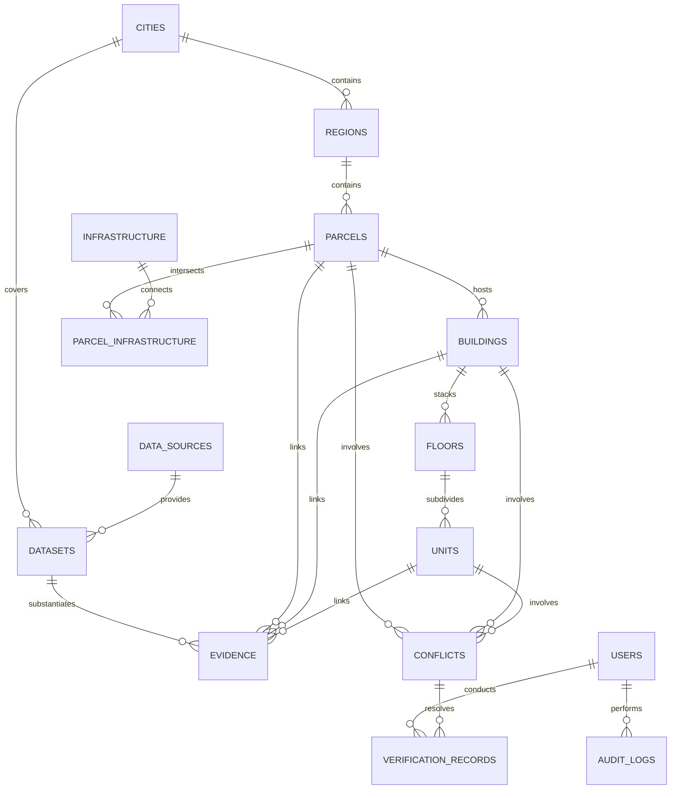

# ASTATINE: Database & PostGIS Entity-Relationship Design
**Project Name:** ASTATINE  
**Team:** TANTRAKATHA  
**Hackathon:** Smart India Hackathon 2026 (SIH 2026) | **Problem Statement:** SIH26011  
**Document Version:** 1.0.0 (Phase 0 Baseline)  
**Status:** Approved Architecture Blueprint  

---

## 1. Database Architecture & Supabase Engine Specifications

- **Database Platform:** Supabase (Managed PostgreSQL 16 + PostGIS 3.4)
- **Supabase Project URL:** `https://qcobqjtrhhdwzmadfykq.supabase.co`
- **Database Schema:** `public` (Single canonical ASTATINE schema)
- **Spatial Extension:** PostGIS 3.4 (Enabled via `CREATE EXTENSION IF NOT EXISTS postgis WITH SCHEMA public;`)
- **Coordinate Reference System (CRS):**
  - Storage Standard: `EPSG:4326` (WGS 84 2D/3D Geographic Coordinates: Longitude, Latitude, Ellipsoidal Height $Z$).
  - Metric Computation Projection: `EPSG:3857` (Web Mercator) or local Universal Transverse Mercator (UTM) zones (e.g., `EPSG:32643` for UTM Zone 43N - Western/Southern India) via `ST_Transform` for area ($m^2$), distance ($m$), and buffer computations.
- **ORM & Type Mapping:** SQLAlchemy 2.0 (AsyncIO) with `GeoAlchemy2` geometry type decorators connecting to Supabase PostgreSQL, paired with Supabase PostgREST & RPC endpoints for spatial queries.

---

## 2. Entity-Relationship Diagram (Mermaid)



---

## 3. Detailed Table Definitions & Schemas

### 3.1 Spatial Administration & Territorial Boundaries

#### `cities`
Defines urban municipal areas managed within ASTATINE.
```sql
CREATE TABLE cities (
    id UUID PRIMARY KEY DEFAULT gen_random_uuid(),
    code VARCHAR(10) UNIQUE NOT NULL,               -- e.g., 'BLR', 'DEL', 'PUN'
    name VARCHAR(100) NOT NULL,                     -- e.g., 'Bengaluru Urban'
    state VARCHAR(100) NOT NULL,                    -- e.g., 'Karnataka'
    country VARCHAR(100) DEFAULT 'India',
    default_srid INTEGER DEFAULT 4326,
    bounds_geom GEOMETRY(Polygon, 4326),            -- City boundary envelope
    created_at TIMESTAMPTZ DEFAULT NOW(),
    updated_at TIMESTAMPTZ DEFAULT NOW()
);
CREATE INDEX idx_cities_bounds ON cities USING GIST(bounds_geom);
```

#### `regions` (Wards / Revenue Circles)
Administrative revenue subdivisions of cities.
```sql
CREATE TABLE regions (
    id UUID PRIMARY KEY DEFAULT gen_random_uuid(),
    city_id UUID NOT NULL REFERENCES cities(id) ON DELETE CASCADE,
    code VARCHAR(50) NOT NULL,                      -- e.g., 'WARD-142'
    name VARCHAR(150) NOT NULL,                     -- e.g., 'BTM Layout Phase 2'
    boundary_geom GEOMETRY(MultiPolygon, 4326) NOT NULL,
    created_at TIMESTAMPTZ DEFAULT NOW()
);
CREATE INDEX idx_regions_city ON regions(city_id);
CREATE INDEX idx_regions_geom ON regions USING GIST(boundary_geom);
```

---

### 3.2 Provenance & Dataset Management

#### `data_sources`
Authoritative institutions or survey contractors providing datasets.
```sql
CREATE TABLE data_sources (
    id UUID PRIMARY KEY DEFAULT gen_random_uuid(),
    name VARCHAR(150) NOT NULL,                     -- e.g., 'Survey of India', 'BBMP GIS Cell'
    organization_type VARCHAR(50) NOT NULL,         -- 'GOVERNMENT', 'MUNICIPAL', 'SURVEYOR_EMPANELLED'
    trust_level VARCHAR(30) DEFAULT 'AUTHORITATIVE',-- 'AUTHORITATIVE', 'COMMERCIAL', 'OPEN_SOURCE'
    contact_email VARCHAR(255),
    created_at TIMESTAMPTZ DEFAULT NOW()
);
```

#### `datasets`
Specific physical files or vector feeds ingested into the platform.
```sql
CREATE TABLE datasets (
    id UUID PRIMARY KEY DEFAULT gen_random_uuid(),
    source_id UUID NOT NULL REFERENCES data_sources(id) ON DELETE RESTRICT,
    city_id UUID NOT NULL REFERENCES cities(id) ON DELETE CASCADE,
    name VARCHAR(200) NOT NULL,                     -- e.g., 'BLR_WARD142_DRONE_2025_5CM.tif'
    dataset_type VARCHAR(50) NOT NULL,              -- 'CADASTRAL_SHP', 'DRONE_ORTHOPHOTO', 'DEM', 'LAS_LIDAR'
    acquisition_date DATE NOT NULL,
    sensor_details VARCHAR(200),                    -- 'DJI Matrice 300 / Zenmuse P1'
    storage_uri TEXT NOT NULL,                      -- S3/MinIO bucket path
    spatial_coverage GEOMETRY(Polygon, 4326),
    created_at TIMESTAMPTZ DEFAULT NOW()
);
CREATE INDEX idx_datasets_spatial ON datasets USING GIST(spatial_coverage);
```

---

### 3.3 The Core Vertical Property Hierarchy

#### `parcels` (2D/3D Cadastral Land Parcel)
The foundational horizontal land boundary.
```sql
CREATE TABLE parcels (
    id UUID PRIMARY KEY DEFAULT gen_random_uuid(),
    city_id UUID NOT NULL REFERENCES cities(id) ON DELETE CASCADE,
    region_id UUID NOT NULL REFERENCES regions(id) ON DELETE RESTRICT,
    ulpin_2d VARCHAR(20) UNIQUE NOT NULL,           -- Official or prototype 14-char ULPIN
    survey_number VARCHAR(100) NOT NULL,            -- e.g., 'Sy. No. 48/2B'
    recorded_area_sqm NUMERIC(12, 2) NOT NULL,      -- Area recorded in revenue deed
    computed_area_sqm NUMERIC(12, 2) NOT NULL,      -- Geodesic area calculated via ST_Area
    land_use VARCHAR(50) NOT NULL,                  -- 'RESIDENTIAL', 'COMMERCIAL', 'INDUSTRIAL', 'AGRICULTURAL'
    geom_2d GEOMETRY(Polygon, 4326) NOT NULL,       -- Surface boundary on ground
    elevation_base NUMERIC(8, 2) DEFAULT 0.0,       -- Mean ground elevation above sea level (m)
    created_at TIMESTAMPTZ DEFAULT NOW(),
    updated_at TIMESTAMPTZ DEFAULT NOW()
);
CREATE INDEX idx_parcels_ulpin ON parcels(ulpin_2d);
CREATE INDEX idx_parcels_geom ON parcels USING GIST(geom_2d);
```

#### `buildings` (3D Physical Structures)
Structures situated on parcels.
```sql
CREATE TABLE buildings (
    id UUID PRIMARY KEY DEFAULT gen_random_uuid(),
    parcel_id UUID NOT NULL REFERENCES parcels(id) ON DELETE CASCADE,
    building_code VARCHAR(50) NOT NULL,             -- e.g., 'BLR-142-BLD-01'
    name VARCHAR(150),                              -- e.g., 'Tower A - Silver Crest'
    building_type VARCHAR(50) NOT NULL,             -- 'HIGH_RISE_RESIDENTIAL', 'COMMERCIAL_COMPLEX'
    footprint_geom GEOMETRY(Polygon, 4326) NOT NULL,-- 2D ground footprint
    ground_elevation NUMERIC(8, 2) NOT NULL,        -- Ground level Z (m AMSL)
    building_height NUMERIC(8, 2) NOT NULL,         -- Total physical height (m)
    detected_floors INTEGER NOT NULL,               -- Floors detected from photogrammetry/LiDAR
    sanctioned_floors INTEGER NOT NULL,             -- Floors sanctioned in municipal plan
    geom_3d GEOMETRY(PolyhedralSurfaceZ, 4326),     -- 3D solid envelope mesh
    created_at TIMESTAMPTZ DEFAULT NOW(),
    updated_at TIMESTAMPTZ DEFAULT NOW()
);
CREATE INDEX idx_buildings_parcel ON buildings(parcel_id);
CREATE INDEX idx_buildings_footprint ON buildings USING GIST(footprint_geom);
CREATE INDEX idx_buildings_geom3d ON buildings USING GIST(geom_3d);
```

#### `floors` (Vertical Floor Plates)
Horizontal spatial levels of a building.
```sql
CREATE TABLE floors (
    id UUID PRIMARY KEY DEFAULT gen_random_uuid(),
    building_id UUID NOT NULL REFERENCES buildings(id) ON DELETE CASCADE,
    floor_number INTEGER NOT NULL,                  -- 0 = Ground, 1 = 1st Floor, -1 = Basement 1
    floor_code VARCHAR(20) NOT NULL,                -- e.g., 'FL-04'
    base_elevation NUMERIC(8, 2) NOT NULL,          -- Floor plate elevation Z_min (m)
    ceiling_elevation NUMERIC(8, 2) NOT NULL,       -- Ceiling elevation Z_max (m)
    floor_height NUMERIC(6, 2) NOT NULL,            -- Clear floor height (m)
    floor_area_sqm NUMERIC(10, 2) NOT NULL,
    geom_3d GEOMETRY(PolyhedralSurfaceZ, 4326),     -- 3D volume of floor plate
    created_at TIMESTAMPTZ DEFAULT NOW()
);
CREATE INDEX idx_floors_building ON floors(building_id);
CREATE INDEX idx_floors_geom3d ON floors USING GIST(geom_3d);
```

#### `units` (Vertical 3D Property Units)
Individual property units carrying discrete 3D ULPINs.
```sql
CREATE TABLE units (
    id UUID PRIMARY KEY DEFAULT gen_random_uuid(),
    floor_id UUID NOT NULL REFERENCES floors(id) ON DELETE CASCADE,
    building_id UUID NOT NULL REFERENCES buildings(id) ON DELETE CASCADE,
    parcel_id UUID NOT NULL REFERENCES parcels(id) ON DELETE CASCADE,
    ulpin_3d VARCHAR(50) UNIQUE NOT NULL,           -- e.g., 'KA-BLR-04-0012-B1-F04-U402'
    unit_number VARCHAR(50) NOT NULL,               -- e.g., 'Flat 402'
    unit_type VARCHAR(50) NOT NULL,                 -- 'APARTMENT', 'OFFICE', 'PARKING_BAY', 'COMMON_UTILITY'
    carpet_area_sqm NUMERIC(8, 2) NOT NULL,
    spatial_centroid_z GEOMETRY(PointZ, 4326) NOT NULL, -- Exact (X, Y, Z) centroid
    geom_3d GEOMETRY(PolyhedralSurfaceZ, 4326),     -- 3D unit volume
    verification_status VARCHAR(30) DEFAULT 'PENDING',-- 'PENDING', 'VERIFIED', 'MODIFIED', 'REJECTED'
    created_at TIMESTAMPTZ DEFAULT NOW(),
    updated_at TIMESTAMPTZ DEFAULT NOW()
);
CREATE INDEX idx_units_ulpin ON units(ulpin_3d);
CREATE INDEX idx_units_floor ON units(floor_id);
CREATE INDEX idx_units_centroid ON units USING GIST(spatial_centroid_z);
```

---

### 3.4 Infrastructure & Subsurface Utilities

#### `infrastructure`
Utilities situated above or below ground.
```sql
CREATE TABLE infrastructure (
    id UUID PRIMARY KEY DEFAULT gen_random_uuid(),
    city_id UUID NOT NULL REFERENCES cities(id) ON DELETE CASCADE,
    name VARCHAR(150) NOT NULL,                     -- e.g., '11kV Substation Feeder Line C'
    utility_category VARCHAR(50) NOT NULL,          -- 'WATER_SUPPLY', 'SEWERAGE', 'POWER_CONDUIT', 'GAS_MAIN'
    is_subsurface BOOLEAN NOT NULL DEFAULT FALSE,
    depth_meters NUMERIC(6, 2) DEFAULT 0.0,         -- Depth below surface (if subsurface)
    evidence_source_type VARCHAR(30) NOT NULL,      -- 'AUTHORITATIVE', 'DERIVED', 'INFERRED', 'ILLUSTRATIVE'
    geom_spatial GEOMETRY(GeometryZ, 4326) NOT NULL,-- PointZ, LineStringZ, or MultiPolygonZ
    created_at TIMESTAMPTZ DEFAULT NOW()
);
CREATE INDEX idx_infra_geom ON infrastructure USING GIST(geom_spatial);
```

#### `parcel_infrastructure` (Associative Table)
```sql
CREATE TABLE parcel_infrastructure (
    parcel_id UUID NOT NULL REFERENCES parcels(id) ON DELETE CASCADE,
    infrastructure_id UUID NOT NULL REFERENCES infrastructure(id) ON DELETE CASCADE,
    intersection_type VARCHAR(50) NOT NULL,         -- 'DIRECT_CONNECTION', 'EASEMENT_CROSSING', 'BUFFER_ENCROACHMENT'
    PRIMARY KEY (parcel_id, infrastructure_id)
);
```

---

### 3.5 Evidence, Provenance & Quality

#### `evidence`
Immutable provenance links tying spatial features to verifiable source datasets.
```sql
CREATE TABLE evidence (
    id UUID PRIMARY KEY DEFAULT gen_random_uuid(),
    entity_type VARCHAR(50) NOT NULL,               -- 'PARCEL', 'BUILDING', 'FLOOR', 'UNIT', 'CONFLICT'
    entity_id UUID NOT NULL,
    dataset_id UUID NOT NULL REFERENCES datasets(id) ON DELETE RESTRICT,
    source_classification VARCHAR(30) NOT NULL,     -- 'AUTHORITATIVE', 'DERIVED', 'INFERRED', 'ILLUSTRATIVE'
    confidence_score NUMERIC(5, 4) NOT NULL,        -- 0.0000 to 1.0000
    processing_method VARCHAR(150) NOT NULL,        -- e.g., 'Photogrammetric Stereo Height Model'
    model_version VARCHAR(50),                      -- e.g., 'Astatine-LoD2-Extruder-v1.4'
    notes TEXT,
    created_at TIMESTAMPTZ DEFAULT NOW()
);
CREATE INDEX idx_evidence_entity ON evidence(entity_type, entity_id);
CREATE INDEX idx_evidence_dataset ON evidence(dataset_id);
```

---

### 3.6 Spatial Discrepancies, Verification & Audit

#### `conflicts`
Spatial discrepancies detected by automated GIS topological engines.
```sql
CREATE TABLE conflicts (
    id UUID PRIMARY KEY DEFAULT gen_random_uuid(),
    conflict_type VARCHAR(100) NOT NULL,            -- 'FOOTPRINT_ENCROACHMENT', 'HEIGHT_DEVIATION', 'AREA_DISCREPANCY'
    severity VARCHAR(20) NOT NULL,                  -- 'LOW', 'MEDIUM', 'HIGH', 'CRITICAL'
    parcel_id UUID REFERENCES parcels(id) ON DELETE SET NULL,
    building_id UUID REFERENCES buildings(id) ON DELETE SET NULL,
    unit_id UUID REFERENCES units(id) ON DELETE SET NULL,
    discrepancy_details JSONB NOT NULL,             -- Detailed parameters (delta_area, offset_dist, etc.)
    deviation_value NUMERIC(10, 2),                 -- Quantitative metric (meters or sq.m)
    conflict_geom GEOMETRY(Geometry, 4326),         -- Geometry highlighting the exact clash zone
    status VARCHAR(30) DEFAULT 'PENDING_REVIEW',    -- 'PENDING_REVIEW', 'VERIFIED', 'DISMISSED', 'RESOLVED'
    created_at TIMESTAMPTZ DEFAULT NOW(),
    updated_at TIMESTAMPTZ DEFAULT NOW()
);
CREATE INDEX idx_conflicts_geom ON conflicts USING GIST(conflict_geom);
CREATE INDEX idx_conflicts_status ON conflicts(status);
```

#### `users` & `verification_records`
Maker-checker record of human officer decisions.
```sql
CREATE TABLE users (
    id UUID PRIMARY KEY DEFAULT gen_random_uuid(),
    email VARCHAR(255) UNIQUE NOT NULL,
    full_name VARCHAR(150) NOT NULL,
    role VARCHAR(50) NOT NULL,                      -- 'ADMIN', 'SURVEYOR', 'GOVERNMENT_OFFICER', 'PLANNER'
    department VARCHAR(150),
    is_active BOOLEAN DEFAULT TRUE,
    created_at TIMESTAMPTZ DEFAULT NOW()
);

CREATE TABLE verification_records (
    id UUID PRIMARY KEY DEFAULT gen_random_uuid(),
    conflict_id UUID REFERENCES conflicts(id) ON DELETE SET NULL,
    entity_type VARCHAR(50) NOT NULL,               -- 'PARCEL', 'BUILDING', 'UNIT', 'CONFLICT'
    entity_id UUID NOT NULL,
    officer_id UUID NOT NULL REFERENCES users(id) ON DELETE RESTRICT,
    action VARCHAR(30) NOT NULL,                    -- 'APPROVE', 'MODIFY', 'REJECT'
    justification TEXT NOT NULL,
    previous_status VARCHAR(30) NOT NULL,
    new_status VARCHAR(30) NOT NULL,
    created_at TIMESTAMPTZ DEFAULT NOW()
);
CREATE INDEX idx_verification_entity ON verification_records(entity_type, entity_id);
```

#### `audit_logs`
Cryptographically chained event ledger ensuring tamper-evident history.
```sql
CREATE TABLE audit_logs (
    id BIGSERIAL PRIMARY KEY,
    user_id UUID REFERENCES users(id) ON DELETE SET NULL,
    action VARCHAR(100) NOT NULL,                   -- e.g., 'UPDATE_GEOMETRY', 'VERIFY_CONFLICT'
    entity_type VARCHAR(50) NOT NULL,
    entity_id UUID NOT NULL,
    previous_state JSONB,
    new_state JSONB,
    ip_address VARCHAR(50),
    prev_hash VARCHAR(64) NOT NULL,                 -- SHA-256 hash of prior log entry
    current_hash VARCHAR(64) NOT NULL,              -- SHA-256(prev_hash + user_id + timestamp + new_state)
    created_at TIMESTAMPTZ DEFAULT NOW()
);
CREATE INDEX idx_audit_entity ON audit_logs(entity_type, entity_id);
```

---

### 3.7 Supabase PostGIS Stored Functions (RPC for Spatial Operations)

To execute high-performance spatial queries directly against Supabase PostGIS without sending raw SQL from client or API layers, standard stored procedures and Remote Procedure Calls (RPC) are established:

```sql
-- Spatial Bounding Box Query for Parcels
CREATE OR REPLACE FUNCTION public.query_parcels_in_bbox(
    min_lon DOUBLE PRECISION,
    min_lat DOUBLE PRECISION,
    max_lon DOUBLE PRECISION,
    max_lat DOUBLE PRECISION,
    limit_count INTEGER DEFAULT 100
)
RETURNS SETOF public.parcels
LANGUAGE sql
STABLE
AS $$
    SELECT *
    FROM public.parcels
    WHERE geom_2d && ST_MakeEnvelope(min_lon, min_lat, max_lon, max_lat, 4326)
    LIMIT limit_count;
$$;

-- Spatial Bounding Box Query for Buildings
CREATE OR REPLACE FUNCTION public.query_buildings_in_bbox(
    min_lon DOUBLE PRECISION,
    min_lat DOUBLE PRECISION,
    max_lon DOUBLE PRECISION,
    max_lat DOUBLE PRECISION,
    limit_count INTEGER DEFAULT 100
)
RETURNS SETOF public.buildings
LANGUAGE sql
STABLE
AS $$
    SELECT *
    FROM public.buildings
    WHERE footprint_geom && ST_MakeEnvelope(min_lon, min_lat, max_lon, max_lat, 4326)
    LIMIT limit_count;
$$;

-- Evaluate Building-Parcel Boundary Encroachment
CREATE OR REPLACE FUNCTION public.evaluate_building_parcel_encroachment(
    p_building_id UUID,
    p_parcel_id UUID
)
RETURNS TABLE(
    has_encroachment BOOLEAN,
    encroachment_area_sqm NUMERIC,
    encroachment_geom GEOMETRY,
    severity VARCHAR
)
LANGUAGE plpgsql
STABLE
AS $$
DECLARE
    v_bld_geom GEOMETRY;
    v_prc_geom GEOMETRY;
    v_diff GEOMETRY;
    v_area NUMERIC;
BEGIN
    SELECT footprint_geom INTO v_bld_geom FROM public.buildings WHERE id = p_building_id;
    SELECT geom_2d INTO v_prc_geom FROM public.parcels WHERE id = p_parcel_id;

    IF v_bld_geom IS NULL OR v_prc_geom IS NULL THEN
        RETURN QUERY SELECT FALSE, 0.0::NUMERIC, NULL::GEOMETRY, 'NONE'::VARCHAR;
        RETURN;
    END IF;

    v_diff := ST_Difference(v_bld_geom, v_prc_geom);
    
    IF v_diff IS NULL OR ST_IsEmpty(v_diff) THEN
        RETURN QUERY SELECT FALSE, 0.0::NUMERIC, NULL::GEOMETRY, 'NONE'::VARCHAR;
    ELSE
        v_area := ROUND(ST_Area(ST_Transform(v_diff, 3857))::NUMERIC, 2);
        
        IF v_area > 0.5 THEN
            RETURN QUERY SELECT 
                TRUE, 
                v_area, 
                v_diff, 
                CASE 
                    WHEN v_area <= 2.0 THEN 'LOW'::VARCHAR
                    WHEN v_area <= 10.0 THEN 'MEDIUM'::VARCHAR
                    ELSE 'HIGH'::VARCHAR
                END;
        ELSE
            RETURN QUERY SELECT FALSE, v_area, NULL::GEOMETRY, 'NONE'::VARCHAR;
        END IF;
    END IF;
END;
$$;
```

---

### 3.8 Supabase Row Level Security (RLS) Architecture

All tables in the Supabase `public` schema have Row Level Security enabled, mapping directly to ASTATINE's six authorization roles (`ADMIN`, `SURVEYOR`, `GOVERNMENT_OFFICER`, `PLANNER`, `ANALYST`, `PUBLIC_USER`):

1. **Certified Base Geometry (`cities`, `regions`, `parcels`, `buildings`, `floors`, `units`):**
   - Read access: Granted to all users (including anonymous / `PUBLIC_USER`).
   - Write / Mutation: Restricted to authenticated users with `ADMIN` or `SURVEYOR` claims.
2. **Sensitive Operational Data (`conflicts`, `verification_records`, `audit_logs`):**
   - Read access: Restricted to authenticated users (`OFFICER`, `PLANNER`, `ANALYST`, `ADMIN`).
   - Write access: Adjudication and approvals strictly reserved for `GOVERNMENT_OFFICER`.
   - Audit log entries: Strictly append-only (`INSERT`), tamper-evident, never editable (`UPDATE` / `DELETE` denied).
