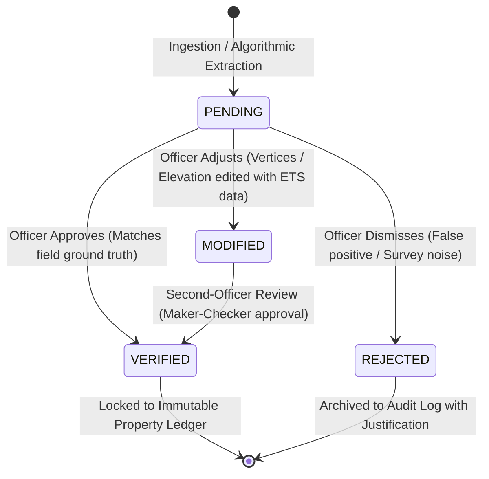

# ASTATINE: Evidence & Provenance Specification
**Project Name:** ASTATINE  
**Team:** TANTRAKATHA  
**Hackathon:** Smart India Hackathon 2026 (SIH 2026) | **Problem Statement:** SIH26011  
**Document Version:** 1.0.0 (Phase 0 Baseline)  
**Status:** Approved Architecture Blueprint  

---

## 1. Foundational Architecture of Evidence-Aware AI

In sovereign land administration, an unverified algorithm can never override a statutory land title or gazetted boundary. ASTATINE introduces the **Evidence-Aware Geospatial Architecture**, which guarantees that:
1. Every physical geometry (parcel, building, floor, unit) and derived attribute is bound to an immutable provenance chain.
2. AI-generated results are treated as **probabilistic proposals**, never as self-authenticating facts.
3. System outputs are strictly audited against the **Five Governance Questions**:
   - **WHAT** did the system detect?
   - **WHY** did the system detect it?
   - **WHAT DATA** supports it?
   - **HOW CONFIDENT** is the system?
   - **WHAT SHOULD THE HUMAN DO NEXT?**

---

## 2. Source Classification Taxonomy

All spatial inputs and derived outputs must be tagged with one of five standardized source levels:

| Classification | Definition & Operational Scope | Permitted Impact on Conflicts | UI Visual Indicator |
| :--- | :--- | :--- | :--- |
| **`AUTHORITATIVE`** | Official statutory records: Revenue Department cadastral shapefiles, municipal sanctioned drawings, Survey of India benchmarks, gazetted notifications. | Serves as ground truth baseline for discrepancy detection. | Solid Blue Badge (`#3b82f6`) with Official Crest Icon |
| **`DERIVED`** | Geometries extracted deterministically or via ML from sensor inputs: Drone orthomosaic segmentation, DEM building height models, photogrammetry meshes. | Triggers `PENDING_REVIEW` spatial conflicts when intersecting authoritative baselines. | Violet Badge (`#8b5cf6`) with Sensor/Algorithm Icon |
| **`INFERRED`** | Algorithmic estimations derived from indirect heuristics: Estimating floor counts from building height using standard 3.0m intervals, approximating unit boundaries from external window arrays. | May generate informational advisories, but **cannot** trigger high-severity legal alerts. | Amber Badge (`#f59e0b`) with Heuristic Icon |
| **`ILLUSTRATIVE`** | Synthesized or placeholder geometries used solely for spatial context or demonstration (e.g., standard municipal road widths, generic tree canopy, simulated utility lines). | **Strictly prohibited** from generating conflict alerts or influencing property records. | Slate Gray Badge (`#64748b`) with Dashed Border |
| **`UNVERIFIED`** | Raw uploads from external contractors or crowd sources prior to automated topological validation and officer curation. | Isolated in quarantine staging tables; invisible on the public 3D ledger. | Muted Red Badge (`#ef4444`) with Warning Shield |

---

## 3. Separation of Confidence and Verification State

A crucial architectural principle in ASTATINE is the **complete mathematical and operational decoupling of Confidence from Verification**:

$$\text{Confidence} \ne \text{Verification}$$

```
+---------------------------------------------------------------------------------------+
| CONFIDENCE (Machine / Sensor Domain)                                                  |
| - A continuous scalar metric: c in [0.00, 1.00] (or 0% - 100%)                       |
| - Measures signal-to-noise ratio, sensor resolution (GSD), multi-angle reprojection   |
|   consistency, and model classification probabilities.                                |
| - Calculated automatically by algorithms during ingestion and processing.             |
+---------------------------------------------------------------------------------------+
                                           VS
+---------------------------------------------------------------------------------------+
| VERIFICATION (Statutory / Human Officer Domain)                                       |
| - A discrete state transition: PENDING -> VERIFIED | MODIFIED | REJECTED             |
| - Represents legal accountability and sovereign approval by an authorized officer.    |
| - Requires human identity, digital signature/timestamp, and justification notes.      |
+---------------------------------------------------------------------------------------+
```

### 3.1 Illustrative Governance Scenarios
- **Scenario A (High Confidence, Unverified):** An AI model detects a building footprint from 3cm drone imagery with $97.4\%$ confidence.
  - *Source Type:* `DERIVED`
  - *Confidence:* `97.4%`
  - *Verification State:* `PENDING` (Cannot be recorded as official until a revenue surveyor approves it).
- **Scenario B (Low Sensor Confidence, Officially Verified):** In heavy tree canopy, photogrammetric confidence was only $68.2\%$. An empanelled surveyor conducts an on-site Electronic Total Station (ETS) ground survey, confirms the coordinates, and signs off.
  - *Source Type:* `AUTHORITATIVE (GROUND SURVEY OVERRIDE)`
  - *Confidence:* `100.0% (FIELD VERIFIED)`
  - *Verification State:* `VERIFIED`

---

## 4. Verification State Transitions



### Verification States:
1. **`PENDING`:** Default state upon ingestion or algorithmic detection. Highlights entity with amber outline.
2. **`VERIFIED`:** An authorized Government Officer or Municipal Town Planner confirms the record. The 3D entity turns emerald green.
3. **`MODIFIED`:** A surveyor edits boundary vertices or corrects floor count to match field inspection. The modification delta is saved with before/after geometry snapshots.
4. **`REJECTED`:** The detected discrepancy is classified as within permissible measurement tolerance (e.g., $< 0.3\text{ m}$) or an optical occlusion error.

---

## 5. Strict Underground Data Architecture

Above-ground remote sensing (satellites, aircraft, optical drones) cannot penetrate the Earth's crust to map subterranean utility conduits or foundation piles.

### 5.1 Rules of Underground Infrastructure Governance
1. **Fabrication Prohibition:** The backend will never infer, extrapolate, or generate buried utility vectors based on road lines or building footprints.
2. **Authoritative Ingestion Only:** Underground vectors must originate from:
   - Official municipal utility GIS shapefiles (Water Supply & Sewerage Board, Power Transmission Corp).
   - Ground Penetrating Radar (GPR) radargram surveys with calibrated depth profiles.
   - Statutory civil engineering "As-Built" BIM/CAD blueprints.
3. **Visual Representation in 3D (CesiumJS):**
   - Authoritative underground features: Rendered as solid 3D cylinders with accurate $Z$-depth below ground level.
   - Illustrative / Simulation features: Rendered as translucent dashed wireframes with conspicuous pulsating watermarks labeled:  
     `[ILLUSTRATIVE UTILITY - NOT AN OFFICIAL SURVEY]`.
   - Illustrative features are excluded from spatial collision queries.
