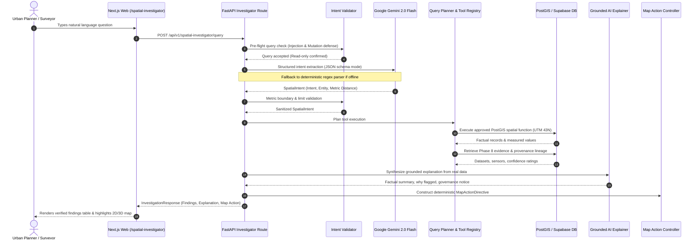

# BhuSetu 3D — Phase 10: Natural-Language Spatial Query + AI Spatial Investigator
**SIH Problem Statement**: SIH26011 — 3D ULPIN Generation and Vertical Property Mapping System  
**Product**: Evidence-Backed 3D Property Intelligence Platform  
**Team**: TANTRAKATHA  
**Status**: Implemented & Verified (Phase 10 Complete)

---

## 1. Executive Summary & Purpose

Phase 10 introduces the **Natural-Language Spatial Query and AI Spatial Investigator** for BhuSetu 3D. While earlier phases established 2D cadastral ingestion, 3D mesh building extraction, vertical property hierarchy (Parcel $\rightarrow$ Building $\rightarrow$ Floor $\rightarrow$ Unit), evidentiary provenance tracking, and deterministic PostGIS spatial conflict detection, Phase 10 overlays an explainable, safe, evidence-grounded natural-language query interface.

Crucially, BhuSetu 3D strictly prohibits unconstrained Text-to-SQL or autonomous database writes. The foundational tenet of the platform is:
$$\textbf{AI Understands the Question} \longrightarrow \textbf{Application Validates the Intent} \longrightarrow \textbf{PostGIS Provides Spatial Truth} \longrightarrow \textbf{Evidence Grounding} \longrightarrow \textbf{Grounded Explanation}$$

---

## 2. Mandatory Spatial Governance Principle

```
        +-------------------------------------------------------+
        |                 NATURAL LANGUAGE QUERY                |
        |      "Show buildings that extend outside parcels"     |
        +---------------------------+---------------------------+
                                    |
                                    v
        +-------------------------------------------------------+
        |                 STRUCTURED SPATIAL INTENT              |
        |  intent: BOUNDARY_DISCREPANCY_QUERY                   |
        |  entity: BUILDING, target: PARCEL                     |
        |  rule: RULE-BLDG-001                                  |
        +---------------------------+---------------------------+
                                    |
                                    v
        +-------------------------------------------------------+
        |              DETERMINISTIC SPATIAL ENGINE             |
        |  PostGIS evaluates ST_Difference(building, parcel)    |
        |  Area > 0.10 m² (Conformal UTM Zone 43N)              |
        +---------------------------+---------------------------+
                                    |
                                    v
        +-------------------------------------------------------+
        |                 MANDATORY GOVERNANCE                  |
        |  "Potential spatial discrepancy detected"             |
        |  "Review required by authorized land surveyor"        |
        |  (NEVER: "Illegal building", "Encroacher", "Fraud")   |
        +-------------------------------------------------------+
```

### Governing Directives:
1. **Advisory Posture**: Every discrepancy is presented as an automated geometric observation (`discrepancy`), never an indictment of statutory wrongdoing.
2. **Neutral Taxonomy**: Statuses transition through `OPEN`, `REVIEWED`, `RESOLVED`, and `DISMISSED`.
3. **No Unrestricted LLM SQL**: The LLM is never given direct SQL generation authority or database access credentials.
4. **Strictly Read-Only**: Destructive commands (`DROP`, `DELETE`, `UPDATE`, `INSERT`, `ALTER`, `TRUNCATE`) are unconditionally rejected.
5. **No Hallucinations**: All measurements, entity IDs, and evidence sources must exist in the database; missing data is truthfully labeled `"unavailable"`.

---

## 3. End-to-End AI Architecture Pipeline



---

## 4. Controlled Spatial Intent Schema

The platform supports a controlled taxonomy of spatial intents defined in `app.schemas.spatial_investigator.SpatialIntentType`:

| Intent Type | Trigger Examples | Approved PostGIS Tool | Description |
| :--- | :--- | :--- | :--- |
| `BOUNDARY_DISCREPANCY_QUERY` | "Show buildings outside parcels", "Check setback issues" | `find_boundary_discrepancies` | Evaluates building footprint overhang outside registered parcel polygons (`RULE-BLDG-001`, `RULE-BLDG-002`). |
| `OVERLAP_QUERY` | "Show parcels overlapping each other", "Boundary collisions" | `find_parcel_overlaps` | Evaluates cadastral polygon overlap area (`RULE-PRCL-001`). Pure boundary touch edges are filtered out. |
| `INFRASTRUCTURE_PROXIMITY_QUERY` | "Properties within 10m of roads", "Buildings near power lines" | `find_nearby_infrastructure` | Evaluates metric distance (`ST_DWithin`) against transportation and utility corridor buffers (`RULE-INFR-001`). |
| `CONFLICT_EXPLANATION` | "Why was this property flagged?", "Explain this finding" | `explain_property_findings` | Synthesizes technical rationale, observed deviations, and underlying rules for an active target entity. |
| `EVIDENCE_QUERY` | "What evidence supports this building?", "What sensor captured this?" | `get_evidence_or_provenance` | Gathers drone imagery, airborne LiDAR, and survey dataset sources from Phase 8. |
| `PROVENANCE_QUERY` | "How was this geometry generated?", "Where did height come from?" | `get_evidence_or_provenance` | Retrieves ML extraction steps, algorithm versions, and transformation DAG lineage. |
| `CLARIFICATION_NEEDED` | "Show properties near infrastructure" (No type or distance specified) | None (Returns Question) | Prompts user to clarify infrastructure corridor type and radius. |
| `UNSUPPORTED` | "Delete all buildings", "Drop table parcels" | None (Rejected) | Blocks destructive commands and unfeasible geographic scopes ($> 2000\text{ m}$). |

---

## 5. Security & Prompt Injection Defense

1. **Pre-Flight Mutation Blocking**:
   Keywords such as `delete`, `drop`, `truncate`, `update`, `insert`, `alter`, `grant`, `revoke`, and `create table` trigger immediate pre-flight rejection with code `UNSUPPORTED` before any tool execution or database interaction.
2. **Metric Boundary Enclosure**:
   Distances are strictly bounded to $\le 2000\text{ meters}$ to avoid spatial combinatorial explosion or server denial-of-service. Result limits are clamped to $\le 50$ rows.
3. **No Direct Database Credentials to AI**:
   Gemini receives only structured JSON context containing already-retrieved, non-sensitive spatial attributes. Database connection strings, service keys, and internal tables are never exposed.
4. **UUID Sanitization**:
   All entity IDs passed via context are strictly parsed through Python's `uuid.UUID` parser to prevent SQL or identifier injection.

---

## 6. Observability & Audit Log

Every spatial investigation is persisted in `public.spatial_investigations`:
- `request_id`: Unique identifier (e.g. `inv_a1b2c3d4e5f6`).
- `user_id`: Authenticated user UUID (or NULL for public exploration).
- `question`: Verbatim user input string.
- `intent`: Classified intent code.
- `tool_executed`: Exact backend spatial tool executed.
- `model_used`: e.g. `gemini-2.0-flash` or `rule-based-parser`.
- `status`: `SUCCESS`, `CLARIFICATION_NEEDED`, `NO_RESULTS`, `UNSUPPORTED`, `ERROR`.
- `duration_ms`: End-to-end execution time in milliseconds.
- `result_count`: Number of verified records returned.
- `execution_trace`: JSONB dictionary containing metric CRS, database engine, and execution parameters.

---

## 7. REST API Endpoints

| Method | Endpoint | Description |
| :--- | :--- | :--- |
| `POST` | `/api/v1/spatial-investigator/query` | Execute natural-language spatial investigation with structured intent parsing, PostGIS execution, and grounded AI explanation. |
| `GET` | `/api/v1/spatial-investigator/suggested-questions` | Retrieve pre-curated question catalog for client-side search pills. |
| `GET` | `/api/v1/spatial-investigator/history` | Retrieve recent investigation audit log entries for observability and session review. |

---

## 8. Verification & Test Coverage

Automated test verification covers all components:
- **`apps/api/tests/test_spatial_investigator.py`**:
  - `test_validator_rejects_destructive_mutation_queries`: Confirms blocking of `DROP`, `DELETE`, and `UPDATE`.
  - `test_validator_accepts_read_only_spatial_queries`: Validates proper read-only queries.
  - `test_validator_enforces_distance_boundaries`: Checks distance bounds ($\le 2000\text{ m}$).
  - `test_validator_clamps_result_limits`: Checks limit clamping to $\le 50$.
  - `test_intent_parser_building_outside_parcel`: Checks extraction of `BOUNDARY_DISCREPANCY_QUERY`.
  - `test_intent_parser_road_proximity_query`: Checks extraction of 10m road proximity.
  - `test_intent_parser_parcel_overlap_query`: Checks extraction of `OVERLAP_QUERY`.
  - `test_intent_parser_why_flagged_with_context`: Checks context preservation for `CONFLICT_EXPLANATION`.
  - `test_intent_parser_evidence_query`: Checks extraction of `EVIDENCE_QUERY`.
  - `test_intent_parser_ambiguous_near_triggers_clarification`: Checks ambiguity detection.
  - `test_spatial_result_grounder_builds_valid_directive`: Checks `MapActionDirective` construction.
  - `test_api_get_suggested_questions`: Verifies suggested questions catalog endpoint.
  - `test_api_execute_investigation_query`: Verifies end-to-end investigation execution.
  - `test_api_mutation_rejection`: Verifies API rejection of mutation attempts.
  - `test_api_investigation_history`: Verifies audit log retrieval endpoint.
- **Full Platform Test Suite**: **103/103 tests passing 100%** (15 new Phase 10 tests + all 88 previous tests across Phases 1–9 preserved without regression).
