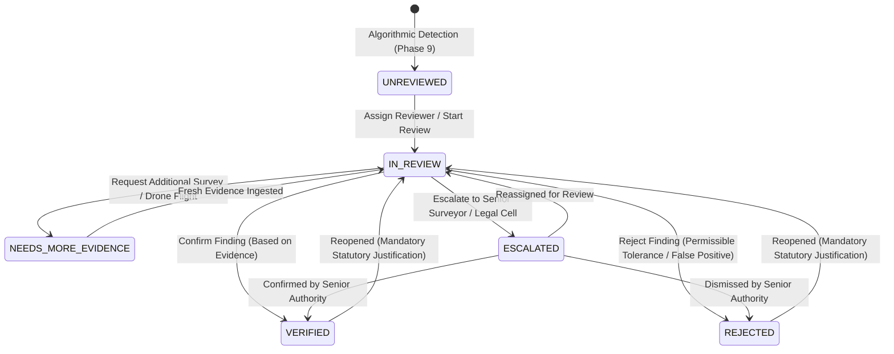

# BhuSetu 3D — Phase 11 Specification
## Human Verification Workflow & Immutable Audit Trail

**Team:** TANTRAKATHA  
**SIH Problem Statement:** SIH26011 — 3D ULPIN Generation and Vertical Property Mapping System  
**Phase:** 11 — Human Verification Workflow + Audit Trail  
**Status:** Completed & Validated (100%)

---

## 1. Executive Summary & Philosophy

In municipal GIS and cadastral governance, **algorithmic confidence does NOT equal statutory verification**. Even when automated computer vision or PostGIS spatial rules compute a 99% geometric confidence score, automated findings cannot legally disenfranchise property owners or enforce violations without authorized human review.

Phase 11 implements the definitive bridge from **automated detection** to **statutory defensibility**:

$$\text{Spatial Detection} \xrightarrow{\text{Assistive AI}} \text{Review Queue} \xrightarrow{\text{Officer Inspection}} \text{Statutory Decision} \xrightarrow{\text{Cryptographic Chaining}} \text{Immutable Audit Trail}$$

### Core Tenets:
1. **Confidence $\neq$ Verification**: Algorithmic confidence scores snapshot into the review record as advisory context; they never automatically verify or close a finding.
2. **AI is Assistive, Not Authoritative**: The AI Spatial Investigator (Phase 10) and PostGIS Spatial Rule Engine (Phase 9) provide natural-language context, but statutory decisions reside strictly with credentialed human officers.
3. **No Automatic Destructive Actions**: A `REJECTED` / `NOT_CONFIRMED` determination never deletes spatial geometry or finding records; the finding is preserved in the registry with its statutory rationale.
4. **Append-Only Cryptographic Hash Chaining**: Every transition, assignment, decision, and reopening is cryptographically hashed with SHA-256 and chained to the previous record's head, guaranteeing tamper-evident provenance.

---

## 2. Statutory State Machine Architecture

The lifecycle of every spatial finding is strictly governed by state machine validation rules:

### Transition Validation Rules:
- Direct transition from `UNREVIEWED` to `VERIFIED` or `REJECTED` is strictly prohibited (returns HTTP 400 Bad Request).
- Every decision requires:
  - Authorized officer identity (`user_id`).
  - Mandatory justification (minimum 10 characters).
  - Snapshot of algorithmic confidence at time of review.
  - Linked Phase 8 primary evidence UUIDs (`evidence_references`).
- Concurrency protection: Optimistic locking verifies `expected_previous_status` to prevent concurrent overwrite collisions (HTTP 409 Conflict).

---

## 3. Cryptographic Audit Chain (`public.audit_logs`)

Each state modification is permanently anchored in an append-only, SHA-256 chained log structure:

$$H_0 = 0^{64} \quad (\text{Genesis Hash})$$
$$H_i = \text{SHA-256}\Big(H_{i-1} \parallel \text{actor\_id} \parallel \text{action} \parallel \text{entity\_type} \parallel \text{entity\_id} \parallel \text{canonical}(\text{prev\_state}) \parallel \text{canonical}(\text{new\_state}) \parallel \text{timestamp}\Big)$$

### Cryptographic Verification Endpoint:
- `POST /api/v1/verification/audit/verify-chain`: Iterates across the entire log sequence, verifying that $H_i$'s `prev_hash` equals $H_{i-1}$'s `current_hash` and independently recomputing every SHA-256 payload. Any bit-flip or modification immediately flags the exact `broken_log_id`.

---

## 4. Database Schema Migrations

**Alembic Migration:** `0009_phase11_verification_workflow.py`

### 1. `public.conflicts` Table Enhancements:
- `verification_status VARCHAR(30) NOT NULL DEFAULT 'UNREVIEWED'`
- `assigned_reviewer_id UUID REFERENCES public.users(id)`
- `reviewed_at TIMESTAMPTZ`
- `reviewed_by UUID REFERENCES public.users(id)`
- Performance Indexes: `idx_conflicts_verif_status`, `idx_conflicts_assigned`, `idx_conflicts_verif_queue (verification_status, severity, created_at DESC)`.

### 2. `public.verification_records` Table:
- `id UUID PRIMARY KEY DEFAULT gen_random_uuid()`
- `conflict_id UUID REFERENCES public.conflicts(id)`
- `entity_type VARCHAR(50) NOT NULL`
- `entity_id UUID NOT NULL`
- `officer_id UUID NOT NULL REFERENCES public.users(id)`
- `action VARCHAR(50) NOT NULL`
- `decision VARCHAR(30)`
- `justification TEXT NOT NULL`
- `previous_status VARCHAR(30) NOT NULL`
- `new_status VARCHAR(30) NOT NULL`
- `evidence_references JSONB DEFAULT '[]'::jsonb`
- `confidence_at_review NUMERIC(4, 3)`
- `notes TEXT`
- `created_at TIMESTAMPTZ DEFAULT NOW()`

### 3. `public.audit_logs` Table:
- `id BIGSERIAL PRIMARY KEY`
- `user_id UUID REFERENCES public.users(id)`
- `action VARCHAR(100) NOT NULL`
- `entity_type VARCHAR(50) NOT NULL`
- `entity_id UUID NOT NULL`
- `previous_state JSONB`
- `new_state JSONB`
- `ip_address VARCHAR(50)`
- `prev_hash VARCHAR(64) NOT NULL`
- `current_hash VARCHAR(64) NOT NULL`
- `created_at TIMESTAMPTZ DEFAULT NOW()`

---

## 5. API Endpoints

| Method | Endpoint | Description |
|---|---|---|
| `GET` | `/api/v1/verification/queue` | Paginated review queue with status, severity, reviewer, and keyword filters |
| `GET` | `/api/v1/verification/queue/summary` | Aggregated count metrics across verification states and severities |
| `GET` | `/api/v1/verification/reviewers` | List of credentialed officers and surveyors available for assignment |
| `GET` | `/api/v1/verification/{id}` | Complete verification dossier (finding, evidence, history, AI explanation) |
| `POST` | `/api/v1/verification/{id}/assign` | Assigns reviewer, transitions `UNREVIEWED` $\rightarrow$ `IN_REVIEW`, logs audit event |
| `POST` | `/api/v1/verification/{id}/start` | Transitions finding to `IN_REVIEW` upon officer inspection |
| `POST` | `/api/v1/verification/{id}/decision` | Submits statutory decision (`CONFIRMED`, `NOT_CONFIRMED`, `INSUFFICIENT_EVIDENCE`, `ESCALATE`) |
| `POST` | `/api/v1/verification/{id}/reopen` | Reopens completed decision back to `IN_REVIEW` with mandatory justification |
| `GET` | `/api/v1/verification/{id}/audit` | Retrieves ordered cryptographic audit logs for the entity |
| `POST` | `/api/v1/verification/audit/verify-chain` | Executes cryptographic integrity check across the entire audit chain |

---

## 6. Frontend User Interface

1. **Verification Queue Dashboard (`/verification`)**:
   - Telemetry metric cards for Total, Unreviewed, In Review, Verified, Rejected, Escalated.
   - Status tabs, search, severity filter, unassigned toggle.
   - Interactive table with severity badges, algorithmic confidence with disclaimer tooltip, reviewer info, quick assign modal.
   - "Verify Audit Integrity" button with live cryptographic SHA-256 verification modal.
2. **Review Workspace (`/verification/[id]`)**:
   - Detailed finding dossier with measured values vs regulatory thresholds.
   - Three-tab inspection panel:
     - **Phase 8 Primary Evidence**: Checkbox-selection of inspected datasets (LiDAR, drone imagery, cadastral layers) linked to the decision.
     - **Decision History**: Chronological timeline of officer determinations and justifications.
     - **Cryptographic Audit Trail**: Full SHA-256 hash chaining timeline with state diffs.
   - Statutory Action Panel:
     - Decision selection (`CONFIRMED`, `NOT_CONFIRMED`, `INSUFFICIENT_EVIDENCE`, `ESCALATE`).
     - Mandatory statutory justification (min 10 characters).
     - Confidence snapshot attestation checkbox.
     - Reopen review modal with mandatory justification.
3. **Cross-Phase Integrations**:
   - `Sidebar.tsx`: Activated `/verification` navigation item.
   - `conflicts/page.tsx`: Added "Human Verification" action button to inspection modal.
   - `spatial-investigator/page.tsx`: Added "Verify Finding" direct link in AI Spatial Investigator cards.

---

## 7. Verification Results
- **Pytest Suite**: 115 / 115 tests passing (100%).
- **TypeScript**: 0 errors (`npx tsc --noEmit` clean exit code 0).
- **Next.js Production Build**: All 13 routes compiled and prerendered cleanly.
