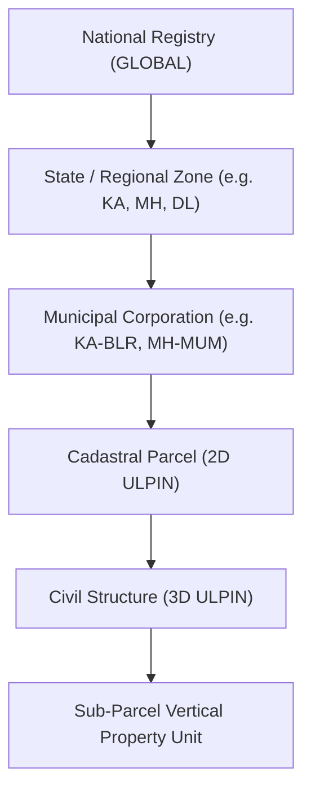

# BhuSetu 3D Enterprise Spatial Analytics Framework

## 1. Architectural Strategy

BhuSetu 3D executes all spatial analytics directly inside **Supabase PostgreSQL 16 + PostGIS 3.4**:
- Aggregations leverage PostGIS index-accelerated spatial joins (`ST_Intersects`, `ST_DWithin`, `ST_Area`).
- Pre-aggregated views and fast queries support City, Region, and National (Global) scopes.
- Zero duplicate data lakes or asynchronous synchronization bottlenecks.

---

## 2. Analytical Dimensions

### 2.1 Cadastral & Vertical Property Assets
- **2D Parcels:** Total registered count, total area (sqm), breakdown by municipal land use (`RESIDENTIAL`, `COMMERCIAL`, `AGRICULTURAL`, `INDUSTRIAL`).
- **3D Buildings:** Total structures, average height (m), average detected floors, polyhedral surface availability.

### 2.2 Spatial Intelligence & Setback Conflicts
- **Conflict Types:** Setback violations, parcel overlaps, infrastructure buffer encroachments.
- **Resolution Lifecycle:** Ratio of resolved vs. open conflicts, severity distribution (`HIGH`, `MEDIUM`, `LOW`).

### 2.3 Statutory Human Verification Workflows
- **Review Statuses:** `CONFIRMED`, `IN_REVIEW`, `PENDING`, `REJECTED`, `ESCALATED`.
- **Reviewer Efficiency:** Average review turnaround time in hours, audit chain integrity verification status.

### 2.4 4D Temporal Changes & Infrastructure Protection
- **Multi-Epoch Events:** Building vertical expansions, parcel subdivisions, boundary modifications.
- **Infrastructure Corridors:** Active buffer safety zones monitored (roads, power lines, water bodies, drainage) and intersecting properties.

---

## 3. Scope Hierarchy

