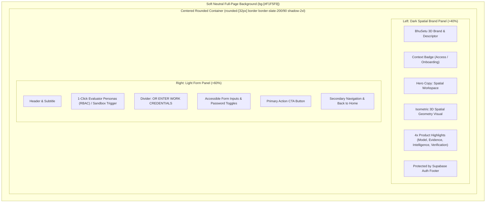

# BhuSetu 3D — Authentication UI Architecture
## Unified Sign In & Sign Up Experience

**Version:** 2.0.0  
**Status:** Production Ready  
**Date:** September 2026  
**Module:** `apps/web/components/auth` & `apps/web/app/(auth)`  

---

## 1. Executive Summary & Layout Pattern

The BhuSetu 3D authentication interface has been redesigned to follow a high-impact, enterprise-grade **split-panel container pattern**. The design balances the technical gravitas of an authoritative 3D cadastral platform with the ease of use expected in modern web applications.



---

## 2. Component Architecture

The authentication system employs a modular, shared component hierarchy avoiding code duplication across Sign In and Sign Up:

```
apps/web/
├── components/
│   └── auth/
│       ├── AuthShell.tsx          # Centered split-panel responsive container
│       ├── AuthBrandPanel.tsx     # Left dark spatial brand panel with isometric visual
│       ├── AuthHeader.tsx         # Clean right-panel title and subtitle
│       ├── AuthInput.tsx          # Accessible form input with labels, icons, error states
│       ├── PasswordField.tsx      # Secure password field with Show/Hide toggle
│       ├── AuthButton.tsx         # Full-width gradient CTA button with loading spinner
│       ├── AuthDivider.tsx        # Subtle horizontal rule with uppercase centered label
│       ├── AuthError.tsx          # Inline accessible error banner (role="alert")
│       ├── SignInForm.tsx         # Complete Sign In composition with 1-click RBAC personas
│       ├── SignUpForm.tsx         # Complete Sign Up composition with sandbox fast-track
│       ├── ProtectedRoute.tsx     # Session route guard protecting authenticated views
│       └── AccessRestricted.tsx   # Role-based authorization wall
├── app/
│   ├── login/page.tsx             # Route /login rendering AuthShell + SignInForm
│   └── signup/page.tsx            # Route /signup rendering AuthShell + SignUpForm
└── hooks/
    └── useAuth.tsx                # Supabase session lifecycle, login, and signUp methods
```

---

## 3. Detailed Specifications

### 3.1. Page Background & Container Geometry
- **Outer Background:** `#F1F5F9` (Soft Slate Gray) with subtle ambient radial dot grid (`[background-size:24px_24px]`) and soft peripheral gradient blurs.
- **Outer Container:** Centered `max-w-5xl` card with `rounded-[28px] md:rounded-[32px]`, subtle `border border-slate-200/90`, and high-depth elevation shadow `shadow-[0_20px_60px_-15px_rgba(15,23,42,0.08)]`.
- **Proportions:** Desktop left panel occupies `≈40%` width; right panel occupies `≈60%` width.

### 3.2. Left Panel: Dark Spatial Identity
- **Background:** Deep obsidian navy (`#080D1A`) with subtle radial background grid texture.
- **Top Brand:** `BHUSETU 3D` logomark with glowing glyph, and `EVIDENCE-BACKED 3D PROPERTY INTELLIGENCE` descriptor.
- **Context Badge:**
  - Sign In: `● Spatial Workspace Access`
  - Sign Up: `● Workspace Onboarding`
- **Hero Copy:**
  - Sign In: *"Enter the Spatial Workspace."* / *"Explore connected 3D property data, spatial intelligence, multi-sensor evidence and investigation in one unified workspace."*
  - Sign Up: *"Build Your Spatial Workspace."* / *"Create your BhuSetu account for connected 3D property intelligence, cadastral modeling, and evidence-backed verification."*
- **Spatial Geometry Visual:** Lightweight vector SVG depicting an isometric cadastral mesh, 3D extruded building envelope, floor slab divisions (`FL-00` to `FL-03`), elevation callouts (`+14.5m MSL`), and parcel survey tag (`KA-BLR-2026-P102`).
- **Product Highlights:**
  1. **3D Property Hierarchy:** `Parcel → Building → Floor → Unit`
  2. **Evidence + Provenance:** `Drone UAV · LiDAR · Satellite fusion`
  3. **Spatial Intelligence:** `Automated setback & height variance rules`
  4. **Statutory Verification:** `Evidence-backed human review workflows`
- **Security Footer:** `Protected by Supabase Authentication`.

### 3.3. Right Panel: Sign In Form (`/login`)
- **1-Click Evaluator Personas (RBAC):** 4 instant-access cards for official roles:
  - **Vikram Sen** — Administrator (`admin.official@bhusetu3d.gov.in`)
  - **Kavita Sharma** — Town Planning Officer (`officer.kavita@bhusetu3d.gov.in`)
  - **Sunil Rao** — Cadastral Surveyor (`surveyor.rao@bhusetu3d.gov.in`)
  - **Priya Nair** — Spatial Analyst (`analyst.priya@bhusetu3d.gov.in`)
- **Credentials Form:**
  - Institutional Work Email (`type="email"`, autocomplete)
  - Password (`type="password"`, Show/Hide eye button)
  - "Remember session" checkbox & "Forgot password?" advisory notice
- **Primary CTA:** Full-width `Sign In to Operations Console →` button.
- **Footer Navigation:** Direct links to `Create Workspace (/signup)` and `← Back to Home Page (/)`.

### 3.4. Right Panel: Sign Up Form (`/signup`)
- **Fast-Track Sandbox Banner:** `1-Click Fast-Track Official Sandbox (seed=BLR)` enabling instant access to the Bengaluru Urban 3D digital twin without manual registration friction.
- **Registration Form:**
  - Full Name (`type="text"`)
  - Organization / Department (`type="text"`)
  - Institutional Work Email (`type="email"`)
  - Password & Confirm Password (with Show/Hide toggle)
  - Spatial Data Governance policy agreement checkbox
- **Primary CTA:** Full-width `Create Workspace & Enter Platform →` button.
- **Footer Navigation:** Direct links to `Sign In (/login)` and `← Back to Home Page (/)`.

---

## 4. Authentication Logic & Session Management

- **Dual-Engine Authentication:**
  1. **Platform API Authenticator:** Validates credentials directly against `AuthApiService.login` (`/api/v1/auth/login`) with signed JWT tokens.
  2. **Supabase Auth Gateway:** Fallback to `supabase.auth.signInWithPassword` and `supabase.auth.signUp`.
- **Session Persistence:** Tokens are securely stored in `localStorage` under key `bhusetu_token` with Supabase real-time auth event listeners (`onAuthStateChange`).
- **Post-Login Routing:** Validated sessions redirect to the authenticated spatial overview (`/overview`), which links seamlessly to `/3d-city`, `/properties`, `/conflicts`, `/evidence`, and `/verification`.
- **Protected Route Guards:** Any unauthenticated attempt to visit `/overview`, `/conflicts`, or `/verification` immediately routes to `/login`.

---

## 5. Responsive Behavior

| Viewport | Layout Strategy | Priority & Adaptation |
| :--- | :--- | :--- |
| **Desktop (`≥ 1024px`)** | 40/60 horizontal split container | Full visual presentation: brand panel, SVG geometry, 4 highlights, 2-column persona grid |
| **Tablet (`768px - 1023px`)** | Compact 40/60 horizontal split | Responsive typography scaling, 1-column persona grid, compact SVG preview |
| **Mobile (`< 768px`)** | Vertical stacking container | Brand panel renders as a compact header, hiding non-essential highlights; form receives 100% focus |

---

## 6. Accessibility & Form UX (WCAG 2.1 AA)

- **Semantic HTML:** All form inputs use explicit `<label>` tags with matching `htmlFor` attributes.
- **ARIA Descriptors:** Inputs feature `aria-invalid` and `aria-describedby` pointing to dynamic error and helper elements.
- **Keyboard Traversal:** Complete keyboard accessibility for tab navigation, focus rings (`focus:ring-2 focus:ring-brand-primary/20`), enter-to-submit, and spacebar checkbox toggles.
- **Password Obfuscation:** Screen-reader accessible Show/Hide toggle buttons with dynamic `aria-label` ("Show password" / "Hide password").
- **Error Callouts:** Rendered with `role="alert"` for real-time screen reader announcements.

---

## 7. Verification Results

- **TypeScript Compilation:** `npx tsc --noEmit` passed with **0 errors and 0 warnings**.
- **Route Status:** Both `/login` and `/signup` verified returning **HTTP 200 OK**.
- **Protected Route Guard:** Unauthenticated access to `/overview` verified cleanly redirecting to `/login`.
- **Clean Content:** Zero ResolveX or third-party placeholder branding; 100% authentic BhuSetu 3D data and messaging.
