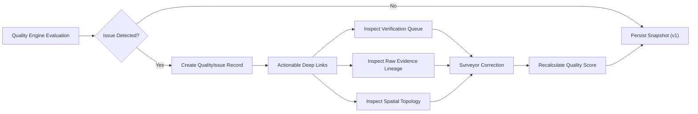

# BhuSetu 3D Data Quality Framework

## 1. Core Philosophy

In spatial governance and cadastre intelligence, data quality is distinct from legal status:
- **Data Quality Score** measures the completeness, geometric structural validity, attribute consistency, provenance lineage, and multi-sensor evidence backing of a digital record.
- **Data Quality $\neq$ Legal Title:** A score of 95/100 does not grant ownership, building permits, or statutory legitimacy. It merely establishes that the digital digital twin representation is complete, topographically consistent, and thoroughly documented.

---

## 2. 7-Component Mathematical Model

The Data Quality Engine computes an explainable, deterministic score using 7 weighted components:

$$\text{Overall Score} = \sum_{i=1}^{7} W_i \times S_i$$

### 2.1 Default Weights ($W_i$)
1. **Completeness ($W_1 = 0.20$):**
   - Mandatory unique identifiers (`ulpin_2d` for parcels, `ulpin_3d` for buildings).
   - Non-empty geometry boundary.
   - Land use / property type classification.
2. **Spatial Validity ($W_2 = 0.20$):**
   - PostGIS `ST_IsValid` closed polygon topology (60%).
   - Multi-dimensional polyhedral envelope availability (40%).
3. **Attribute Consistency ($W_3 = 0.15$):**
   - Positive geometric area and plausible floor-to-height ratio (50%).
   - Municipal boundary hierarchy anchor (`city_id` / parent parcel linkage) (50%).
4. **Provenance Coverage ($W_4 = 0.15$):**
   - Extraction lineage linked to authoritative sensor surveys or algorithmic pipelines (100%).
5. **Evidence Coverage ($W_5 = 0.15$):**
   - Raw multi-sensor ground truth observations (point clouds, orthophotos, total station points) (100%).
6. **Verification Coverage ($W_6 = 0.10$):**
   - Approved statutory human review decisions in cryptographic hash-chained audit ledger (100%).
7. **Temporal Coverage ($W_7 = 0.05$):**
   - Multi-epoch 4D timestamp baseline and recorded change event lineage (100%).

---

## 3. Quality Tiers & Non-Accusatory Classification

| Score Range | Official Classification | Interpretation |
|---|---|---|
| **85.0 – 100.0** | *High data quality* | Comprehensive record with valid geometry, full evidence chain, and verification. |
| **70.0 – 84.9** | *Moderate data quality* | Structurally sound record; may lack secondary sensor evidence or 3D polyhedral mesh. |
| **50.0 – 69.9** | *Fair data quality* | Usable record; missing key municipal attributes or unverified. |
| **0.0 – 49.9** | *Needs data attention* | Incomplete or unclosed boundary topology; requires immediate surveyor inspection. |

---

## 4. Actionable Remediation Flow

