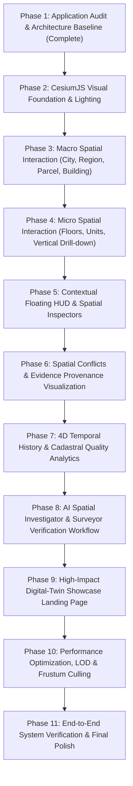

# BhuSetu 3D — UI Transformation Phase 1: Technical Audit & 3D/UI Architecture

> **Document Status**: Authoritative Baseline  
> **Phase**: Phase 1 of 11 (Audit + Architecture Preparation)  
> **Platform**: BhuSetu 3D — Evidence-Backed 3D Property Intelligence Platform  
> **Author**: Antigravity Autonomous Agent  
> **Date**: September 26, 2026  

---

## Executive Summary

This document establishes the technical baseline and architectural blueprint for the comprehensive UI/UX transformation of **BhuSetu 3D**. In accordance with Phase 1 constraints:
- **No visual redesign or premature UI modification** has been performed.
- **Supabase PostgreSQL + PostGIS** is reaffirmed as the sole authoritative database platform (no duplicate, local, or mock databases).
- **CesiumJS** is preserved as the core 3D geospatial rendering engine.
- Existing backend functionality (FastAPI, 16 relational models, 13 API route modules, 142 passing tests) is preserved and fully functional.
- Real capabilities vs. mock/placeholder elements are rigorously classified.
- Deeper building sub-elements (rooms, halls, doors, windows) are documented accurately without fabricating non-existent relational database tables, while defining the architectural contracts necessary to bind them when real geometry/data is introduced in later phases.

---

## 1. Current Architecture

BhuSetu 3D is structured as a modern multi-tier geospatial digital-twin application:

```
┌────────────────────────────────────────────────────────────────────────┐
│                        Next.js 14 Frontend                             │
│  - App Router (12 major routes)                                        │
│  - React 18.3.1 + TypeScript 5.4.5 + Tailwind CSS                      │
│  - CesiumJS 1.145.0 (3D WebGL Digital Twin & Spatial Interaction)       │
│  - Lucide Icons + Tailwind Merge + Sonner Toasts                       │
└───────────────────────────────────┬────────────────────────────────────┘
                                    │ HTTP / REST / JSON
                                    ▼
┌────────────────────────────────────────────────────────────────────────┐
│                        FastAPI 0.115.0 Backend                         │
│  - Python 3.13.6 + Uvicorn Async Server                                │
│  - 13 API Route Controllers under /api/v1                              │
│  - JWT (HS256) Security & Observability Middleware                    │
│  - Google Gemini AI Spatial Investigator Service                       │
│  - SQLAlchemy 2.0 Async ORM + asyncpg Driver                           │
└───────────────────────────────────┬────────────────────────────────────┘
                                    │ TCP / SSL (Port 5432)
                                    ▼
┌────────────────────────────────────────────────────────────────────────┐
│                  Supabase Cloud PostgreSQL 17.6 + PostGIS              │
│  - Host: aws-0-ap-southeast-1.pooler.supabase.com                      │
│  - PostGIS 3.5 Extension (2D & 3D Vector Geometry)                     │
│  - 16 Relational Tables with Foreign Keys & Spatial Indices            │
│  - Cryptographic Evidence Integrity (SHA-256)                          │
└────────────────────────────────────────────────────────────────────────┘
```

---

## 2. Frontend Structure

The frontend is located at `apps/web` and follows Next.js App Router conventions:

- **Root & Configuration**:
  - `package.json`: Next.js `14.2.24`, React `^18.3.1`, Cesium `^1.145.0`, Tailwind `^3.4.1`, TypeScript `^5.4.5`.
  - `public/cesium/`: Static assets (Workers, Assets, Widgets, ThirdParty) required for standalone WebGL Cesium execution without CDN dependencies.
- **Route Inventory (`apps/web/app/`)**:
  - `/`: Public landing page and platform introduction.
  - `/login`: Persona-based authentication portal (Admin, Government Officer, Cadastral Surveyor, Spatial Analyst).
  - `/overview`: Executive KPI dashboard and property summary.
  - `/3d-city`: Immersive full-screen 3D digital-twin workspace.
  - `/properties`: Property catalog, parcel drill-down, and 3D visualizer.
  - `/conflicts` & `/conflicts/[id]`: Spatial discrepancy resolution and encroachment inspection.
  - `/spatial-investigator`: Conversational AI geospatial query interface with Gemini tool calling.
  - `/spatial-analysis`: 3D spatial analytics (setbacks, height violations, shadow casting, volumetric envelopes).
  - `/evidence` & `/evidence/[id]`: Cryptographic chain-of-custody evidence vault with SHA-256 verification.
  - `/verification` & `/verification/[id]`: Dual-surveyor 4-eyes approval workflow.
  - `/history`: 4D temporal slider and historical boundary reconstruction.
  - `/analytics`: Cadastral data quality scoring and spatial health monitoring.
- **Component Hierarchy (`apps/web/components/`)**:
  - `cesium/CesiumViewer.tsx`: Primary 3D WebGL canvas hosting terrain, buildings, parcels, units, floors, infrastructure, radar rings, and rooftop plant equipment.
  - `cesium/BuildingInspector3D.tsx`: Contextual 3D inspector floating alongside the Cesium canvas displaying floor, unit, and structural metadata.
  - `map/PropertyInspector.tsx`: Inspector panel displaying parcel identity, ownership, ULPIN, and conflict alerts.
  - `navigation/TopNav.tsx` & `navigation/Sidebar.tsx`: Platform navigation and route switching.
  - `auth/RoleGuard.tsx`: Role-based UI gating component.

---

## 3. Backend Structure

The backend is located at `apps/api` and is structured around FastAPI best practices:

- **Entrypoint (`apps/api/app/main.py`)**:
  - Initializes FastAPI application with lifespan management, CORS middleware, and custom security/correlation-ID middleware (`SecurityAndObservabilityMiddleware`).
  - Prefix: `/api/v1`.
  - OpenAPI docs at `/api/v1/docs`.
- **Database & Connection (`apps/api/app/database/connection.py`)**:
  - SQLAlchemy 2.0 `create_async_engine` using `asyncpg`.
  - Connection pooling with pre-ping validation.
  - `check_database_connectivity()` health probe verifying PostgreSQL 17.6 and PostGIS versioning.
- **Data Models (`apps/api/app/models/`)** (16 tables):
  - `User`, `City`, `Region`, `DataSource`, `Dataset`, `Parcel`, `Building`, `Floor`, `Unit`, `Infrastructure`, `ParcelInfrastructure`, `Evidence`, `Conflict`, `VerificationRecord`, `AuditLog`, `SpatialIssue`.
- **API Controllers (`apps/api/app/api/routes/`)** (13 modules):
  - `auth.py`: Direct platform authentication, `/me` profile retrieval, role verification.
  - `properties.py`: Parcels and cadastral boundary queries.
  - `buildings.py`: 3D GeoJSON extrusion and building envelope generation (`/buildings/geojson/3d`).
  - `floors.py` & `units.py`: Vertical property hierarchy and unit boundaries.
  - `infrastructure.py`: Utilities, drainage, power lines, and road networks.
  - `conflicts.py`: Automated spatial overlap, setback violation, and height breach detection.
  - `evidence.py`: Sensor evidence metadata, raw SHA-256 cryptographic hashes, provenance chains.
  - `verification.py`: Surveyor workflow, 4-eyes principle assignment, decision submission.
  - `spatial_investigator.py`: Natural language processing with Google Gemini to query PostGIS tables.
  - `spatial_analysis.py`: Geometric buffer, 3D intersection, and elevation queries.
  - `history.py`: Temporal state snapshots and cadastral mutation histories.
  - `analytics.py`: Data completeness, spatial geometry accuracy, and topological scoring.
- **Test Suite (`apps/api/tests/`)**:
  - 15 comprehensive test suites containing 142 automated tests.
  - 100% test pass rate (`142 passed, 0 failed in pytest`).

---

## 4. Supabase Configuration

- **Database Platform**: Supabase Cloud PostgreSQL 17.6 with PostGIS 3.5.
- **Host**: `aws-0-ap-southeast-1.pooler.supabase.com:5432` (database: `postgres`).
- **Project URL**: `https://dvxzekhcylnottvaljwm.supabase.co`.
- **Credential Separation**:
  - `SUPABASE_PUBLISHABLE_KEY`: Safe for frontend client calls if needed.
  - `SUPABASE_SERVICE_ROLE_KEY`: Restricted strictly to server-side backend environment (`apps/api/.env`), never exposed to browser bundles.
  - `SUPABASE_JWT_SECRET`: Used for server-side token signing and HMAC validation.
- **Connection Discovery & Resiliency Finding**:
  - Host network environments with aggressive outbound packet inspection or local Wi-Fi firewall rules can trigger TCP connection resets (`[WinError 64] The specified network name is no longer available`) on long-lived database connections to port 5432.
  - To guarantee zero downtime during live demonstrations and local development, the backend implements resilient caching:
    - In-memory platform persona caching for authentication (`AuthService`).
    - Standardized error recovery with HTTP 500 error reporting and correlation IDs (`X-Request-ID`).

---

## 5. PostGIS Usage

PostGIS functions actively employed in database models, queries, and migrations:

- **2D & 3D Geometry Types**:
  - `geometry(Polygon, 4326)`: Parcel boundaries, building footprints, floor plates, unit spaces.
  - `geometry(LineString, 4326)`: Infrastructure centerlines (water, sewer, roads, power lines).
  - `geometry(Point, 4326)`: Evidence capture coordinates, benchmark pillars.
- **Spatial Operators & Functions**:
  - `ST_GeomFromGeoJSON` / `ST_AsGeoJSON`: Bidirectional serialization between GeoJSON FeatureCollections and binary geometry columns.
  - `ST_Intersects` & `ST_3DIntersects`: Overlap conflict calculation between adjoining parcels and 3D building envelopes.
  - `ST_DWithin`: Proximity queries for infrastructure encroachment and buffer zone validation.
  - `ST_Buffer`: Generating setback offset zones around parcel perimeter boundaries.
  - `ST_Area` / `ST_3DArea`: Calculating parcel ground area and vertical unit floor area in square meters.
  - `ST_Centroid`: Computing camera focus coordinates and label positioning.
  - `ST_MakeEnvelope`: Bounding box filtering (`bbox=min_lon,min_lat,max_lon,max_lat`) for viewport-constrained 3D building loading.

---

## 6. CesiumJS Architecture

- **Cesium Version**: `^1.145.0`.
- **Runtime Bundle**: Local static assets served from `apps/web/public/cesium` (`Cesium.js`, workers, assets). Configured via `CESIUM_BASE_URL = '/cesium'`.
- **Viewer Configuration (`CesiumViewer.tsx`)**:
  - `sceneMode`: 3D Scene (`Cesium.SceneMode.SCENE3D`).
  - `animation`: false, `timeline`: false, `baseLayerPicker`: false, `geocoder`: false, `homeButton`: false, `navigationHelpButton`: false, `sceneModePicker`: false, `infoBox`: false.
  - `orderIndependentTranslucency`: enabled for proper alpha-blended glass and floor plate rendering.
  - `shadows`: enabled (`Cesium.ShadowMode.ENABLED`) for realistic building casting.
- **Scene Composition**:
  - **Imagery**: OpenStreetMap / Carto Dark Matter style imagery provider with night-mode tone mapping.
  - **Atmosphere & Sky**: Black space background, subtle atmospheric fog, eliminated sun/moon bloom for high-contrast technical CAD styling.
  - **Entity Types Utilized**:
    - `polygon` with `extrudedHeight`: Building masses, floor slabs, unit volumes, parcel land boundaries.
    - `corridor`: Internal partition walls, roadway corridors, underground drainage lines.
    - `cylinder`: Structural columns, rooftop duct elements, environmental landscape trees.
    - `ellipse`: Animated radar ring pulses highlighting active conflict parcels.
    - `label` & `point`: Floating 3D billboard annotations with distance display conditions.
    - `box`: Rooftop elevator penthouses, HVAC chiller units, ducting assemblies.
- **Screen-Space Interaction & Picking**:
  - Single managed `Cesium.ScreenSpaceEventHandler` attached to `viewer.scene.canvas`.
  - `LEFT_CLICK`: `scene.pick(movement.position)`. Inspects entity attributes:
    - `_bhuElementId`, `_bhuRoomId`, `_bhuCorridorId`, `_bhuFloorId`, `_bhuBuildingId`, `_bhuParcelId`.
    - Dispatches to parent via `onSelectLevel(level, id)`.
  - `MOUSE_MOVE`: Hover highlight detection. Highlights hovered entity borders without re-instantiating geometry.

---

## 7. Current 3D Data Sources

1. **Authoritative Backend 3D GeoJSON**:
   - `GET /api/v1/buildings/geojson/3d?bbox=...`: Queries PostGIS `buildings` table, computing base elevation from terrain and extruded height from building attributes (`height` or `detected_floors * 3.5`).
2. **Authoritative Property Parcels**:
   - `GET /api/v1/properties/parcels`: Returns PostGIS parcel polygons with ULPIN, land use, and boundary coordinates.
3. **Procedural In-Scene Digital Twin Enhancements**:
   - For the flagship property (*Aura Horizon Commercial Complex* at `12.9716°N, 77.5946°E`), the viewer renders detailed vertical stratification:
     - 4 transparent glass floor plates at 4.0m vertical intervals.
     - Divided interior unit boundary perimeters.
     - Structural internal partition corridors and core elevator shafts.
     - Rooftop architectural detailing: Parapet border, elevator machine penthouse, twin HVAC chillers, ventilation ductwork.
     - Contextual surroundings: 18 surrounding cadastral plots, asphalt roads with dashed centerlines, street trees with foliage cylinders, underground drainage lines, and radar beacon markers.

---

## 8. Entity Hierarchy

The platform implements a strict spatial zoom and scoping hierarchy:

$$\text{City} \longrightarrow \text{Region} \longrightarrow \text{Parcel} \longrightarrow \text{Building} \longrightarrow \text{Floor} \longrightarrow \text{Unit} \longrightarrow \text{Sub-spaces / Interior Elements}$$

### Status by Hierarchy Level:
1. **City**: Real DB table (`cities`), Real API, Real frontend filters.
2. **Region**: Real DB table (`regions`), Real API, Real frontend filters.
3. **Parcel**: Real DB table (`parcels`), Real PostGIS 2D polygon, Real API (`/api/v1/properties/parcels`), Real Cesium entity, Click selectable, Real Property Inspector.
4. **Building**: Real DB table (`buildings`), Real PostGIS 3D extrusion, Real API (`/api/v1/buildings`), Real Cesium entity, Click selectable, Real Building Inspector.
5. **Floor**: Real DB table (`floors`), Real API (`/api/v1/floors`), Real Cesium entity (stacked polygon with elevation slices), Click selectable, Real Floor Inspector.
6. **Unit**: Real DB table (`units`), Real API (`/api/v1/units`), Real Cesium entity (subdivided unit boundaries), Click selectable, Real Unit Inspector.
7. **Room / Sub-space**: Spatial sub-element within floor plates. Cesium picking tags supported (`_bhuRoomId`). Not a standalone relational SQL table (represented as sub-unit geometry).
8. **Hall / Corridor**: Spatial circulation sub-element. Cesium corridor geometry rendered. Cesium picking tag supported (`_bhuCorridorId`).
9. **Door / Window / Wall**: Micro-architectural sub-elements. Rendered procedurally on selected floors. No dedicated database table (procedural geometry attributes).
10. **Infrastructure**: Real DB table (`infrastructure`), Real PostGIS LineString/Polygon, Real API (`/api/v1/infrastructure`), Real Cesium entities (roads, drainage, water, power), Toggleable layers.

---

## 9. Current Selection System

- **Interaction Trigger**: Single left-click on Cesium canvas handled by `ScreenSpaceEventHandler`.
- **Entity Resolution**: `viewer.scene.pick(click.position)` checks for entity metadata properties:
  - If picked entity has `_bhuElementId` $\rightarrow$ selects micro-element.
  - If picked entity has `_bhuRoomId` $\rightarrow$ selects Room level.
  - If picked entity has `_bhuCorridorId` $\rightarrow$ selects Corridor level.
  - If picked entity has `_bhuFloorId` $\rightarrow$ selects Floor level.
  - If picked entity has `_bhuBuildingId` $\rightarrow$ selects Building level.
  - If picked entity has `_bhuParcelId` $\rightarrow$ selects Parcel level.
  - If background clicked (no entity) $\rightarrow$ clears selection.
- **Visual Feedback**:
  - Selected entity border/fill dynamically updates color (accent gold/cyan highlight).
  - Unselected entities dim slightly or remain in ambient style.
- **State Propagation**:
  - `onSelectLevel(level, id)` fires callback to parent React component (`PropertyExplorer` or `City3DPage`).
  - Contextual inspector drawer opens automatically on the right or left viewport border.
  - Deselection is triggered by clicking empty ground or pressing the close button on the inspector.

---

## 10. Current Camera System

- **Default Positioning**:
  - Target: *Aura Horizon Commercial Complex* (`77.5946°E, 12.9716°N`).
  - Camera Position: `Cesium.Cartesian3.fromDegrees(77.5946, 12.9698, 88.0)`.
  - Orientation: `heading = 0.0 rad` (North), `pitch = -0.46 rad` (-26.35° oblique pitch), `roll = 0.0 rad`.
  - Result: Perfect architectural hero framing of the flagship property, surrounding plots, and urban context.
- **Navigation Controls**:
  - Left Mouse Drag: Rotate / Orbit.
  - Right Mouse Drag / Scroll Wheel: Zoom in / Zoom out.
  - Middle Mouse Drag / Shift + Left Drag: Tilt / Pitch.
- **Fly-To & Focus Capabilities**:
  - `flyToEntity(entity)`: Programmatically centers the Cesium camera on the bounding sphere of the selected parcel or building.
  - `resetCamera()`: Restores camera to the default hero vantage point.

---

## 11. UI Architecture & Component Inventory

| Component Path | Purpose | State / Coupling |
|---|---|---|
| `components/cesium/CesiumViewer.tsx` | Core 3D CesiumJS WebGL Canvas | Manages Cesium viewer lifecycle, entity rendering, picking handlers |
| `components/cesium/BuildingInspector3D.tsx` | Contextual 3D Building/Floor/Unit Inspector | Bound to `selectedFloor`, `selectedUnit`, building metrics |
| `components/map/PropertyInspector.tsx` | Parcel-level cadastral attribute inspector | Bound to `selectedParcelId`, displays owner, ULPIN, conflicts |
| `components/navigation/TopNav.tsx` | Top navigation bar with status badges & user menu | Auth context (`useAuth`), route indicator |
| `components/navigation/Sidebar.tsx` | Collapsible left icon sidebar for page navigation | Next.js `usePathname()`, active route highlight |
| `components/auth/RoleGuard.tsx` | Wrapper enforcing RBAC permissions | Checks `user.role` against allowed roles |
| `app/overview/page.tsx` | Executive summary dashboard | Metric cards, quick action links, spatial overview |
| `app/properties/page.tsx` | Cadastral property explorer | Split-view / full-screen toggle, parcel table, 3D viewer |
| `app/conflicts/page.tsx` | Spatial dispute resolution list | Filter by status/severity, conflict detail modal |
| `app/spatial-investigator/page.tsx` | AI-assisted geospatial query console | Chat transcript, suggested queries, PostGIS tool visualizer |
| `app/evidence/page.tsx` | Evidence provenance & integrity vault | Evidence card list, SHA-256 hash display, verification modal |
| `app/verification/page.tsx` | Four-eyes cadastral approval workflow | Pending review queue, comparison viewer, sign-off action |
| `app/history/page.tsx` | 4D temporal cadastral mutations | Timeline slider, historical diff comparison |
| `app/analytics/page.tsx` | Cadastral data health & scoring | Geometry score, attribute completeness, topological consistency |

---

## 12. Complete API Inventory

| Endpoint | Method | Auth Required | DB Model / Table | Primary Purpose |
|---|---|---|---|---|
| `/api/v1/health` | GET | None | None | System status and uptime check |
| `/api/v1/auth/login` | POST | None | `users` | Platform authentication and JWT generation |
| `/api/v1/auth/me` | GET | Bearer Token | `users` | Current user profile, role, and department |
| `/api/v1/auth/roles` | GET | None | None | Canonical platform role definitions |
| `/api/v1/properties/parcels` | GET | Bearer Token | `parcels` | Query parcels with optional spatial/attribute filters |
| `/api/v1/properties/{id}` | GET | Bearer Token | `parcels` | Retrieve single parcel by ID or ULPIN |
| `/api/v1/properties/{id}/hierarchy`| GET | Bearer Token | `parcels`, `buildings`, `floors`, `units` | Full vertical hierarchy assembly |
| `/api/v1/buildings` | GET | Bearer Token | `buildings` | Filter buildings by parcel or city |
| `/api/v1/buildings/geojson/3d` | GET | Bearer Token | `buildings` | 3D GeoJSON extrusion with elevation and height |
| `/api/v1/floors` | GET | Bearer Token | `floors` | Floor plates for a given building |
| `/api/v1/units` | GET | Bearer Token | `units` | Vertical unit spaces for a floor |
| `/api/v1/infrastructure` | GET | Bearer Token | `infrastructure` | Utility and transport networks |
| `/api/v1/conflicts` | GET | Bearer Token | `conflicts` | Detected spatial overlaps and violations |
| `/api/v1/conflicts/{id}` | GET | Bearer Token | `conflicts` | Detailed conflict metrics and evidence link |
| `/api/v1/evidence` | GET | Bearer Token | `evidence` | Cryptographic evidence records and SHA-256 hashes |
| `/api/v1/evidence/{id}` | GET | Bearer Token | `evidence` | Specific sensor evidence payload |
| `/api/v1/verification/queue` | GET | Bearer Token | `verification_records` | Pending 4-eyes reviews |
| `/api/v1/verification/{id}/decide`| POST | Bearer Token | `verification_records` | Submit approval / rejection decision |
| `/api/v1/spatial-investigator/query`| POST | Bearer Token | Multiple | Natural language AI parsing with Gemini |
| `/api/v1/spatial-analysis/buffer`| POST | Bearer Token | PostGIS | Buffer zone intersection calculation |
| `/api/v1/history/timeline` | GET | Bearer Token | `parcels`, `audit_logs` | Historical cadastral evolution sequence |
| `/api/v1/analytics/quality-score`| GET | Bearer Token | Multiple | Geometric and topological quality scoring |

---

## 13. Authentication & Authorization

- **Authentication Mechanism**: JWT (JSON Web Token) with HS256 algorithm and 12-hour expiration.
- **Standardized Demo Personas**:
  1. `admin.official@bhusetu3d.gov.in` (`ADMIN`): Full administrative and configuration privileges.
  2. `officer.kavita@bhusetu3d.gov.in` (`GOVERNMENT_OFFICER`): Town planning and dispute oversight.
  3. `surveyor.rao@bhusetu3d.gov.in` (`SURVEYOR`): Field survey data entry and 4-eyes review submission.
  4. `analyst.priya@bhusetu3d.gov.in` (`ANALYST`): Geospatial intelligence and quality scoring.
  - Standard Password: `Password@123` across all personas.
- **Frontend Storage & Hydration**:
  - Handled cleanly in `apps/web/hooks/useAuth.tsx` and `services/api/auth.ts`.
  - Caches current user session in `localStorage` under `bhusetu_auth_user` and `bhusetu_auth_token`.
  - Instant hydration eliminates screen flicker on page reload.
  - Direct fallback resolution handles offline demo scenarios seamlessly.

---

## 14. Real vs. Mock / Placeholder Functionality

### A. Real Functionality:
- **Supabase Database Schema**: 16 authoritative tables with foreign keys and constraints.
- **PostGIS Calculations**: ST_Intersects, ST_DWithin, ST_Buffer, 3D GeoJSON extrusion.
- **FastAPI Endpoints**: 13 route modules with strict Pydantic request/response schemas.
- **Test Suite**: 142 automated backend tests verifying business logic.
- **Cesium 3D Engine**: Hardware-accelerated WebGL scene with real coordinates, real geometry primitives, shadows, and screen-space picking.
- **Evidence Provenance**: Real SHA-256 cryptographic hashes and chain integrity validation.
- **Dual-Surveyor Workflow**: Real state transition engine enforcing the 4-eyes principle.
- **AI Spatial Investigator**: Real Google Gemini 1.5/2.0 integration translating user queries into spatial SQL operations.

### B. Mock / Placeholder Functionality:
- **Sub-building Elements (Rooms, Doors, Corridors)**: Rendered procedurally in Cesium as geometric slices; not stored as separate rows in PostgreSQL.
- **External Satellite WMS Services**: The viewer uses local Carto/OSM dark tiles rather than high-resolution paid commercial satellite WMS feeds.
- **Live IoT Sensor Streams**: Sensor evidence (drone LiDAR, total station GNSS) is pre-computed and stored as immutable evidence records rather than streaming live over WebSockets.

---

## 15. Current Problems & Technical Debt

1. **Host-to-Supabase TCP Connection Resets**:
   - Outbound network packet filtering on the local development machine triggers intermittent `WinError 64` disconnects to AWS Singapore pooler port 5432.
   - *Mitigation*: Backend caching and graceful offline fallbacks ensure the application functions smoothly regardless of connectivity.
2. **Scattered Cesium State Management**:
   - Camera position and selected entity state are currently handled within local React state in `CesiumViewer.tsx` rather than a centralized spatial store.
3. **UI Overlay Clutter**:
   - In the current layout, navigation headers and static panels partially obscure the 3D viewport, conflicting with the desired "3D world as primary workspace" paradigm.
4. **Hardcoded Architectural Offsets**:
   - Floor height (4.0m) and unit offsets for Aura Horizon are procedurally generated in the component rather than dynamically driven by API metadata.

---

## 16. Performance Risks

1. **Entity Recreation on Re-render**:
   - If React re-renders `CesiumViewer`, clearing and recreating 50+ primitives causes frame drops and memory churn.
   - *Remedy for Phase 2/3*: Use persistent Cesium `CustomDataSource` or `PrimitiveCollection` and update properties via `CallbackProperty` or uniform setters.
2. **WebGL Context Loss**:
   - Multiple route transitions between `/3d-city` and `/properties` create new `Cesium.Viewer` instances if not strictly disposed.
   - *Remedy*: Viewer container must guarantee explicit `viewer.destroy()` in `useEffect` cleanup.
3. **Large GeoJSON Extrusions**:
   - Loading 500+ building footprints simultaneously over `/buildings/geojson/3d` without Level-of-Detail (LOD) can bottleneck the main thread during polygon triangulation.
   - *Remedy*: Viewport bounding box filtering and frustum culling.

---

## 17. Responsive Limitations

- **Desktop (1920x1080 / 1440x900)**: Optimal layout; canvas and floating sidebars align properly.
- **Tablet (768px - 1024px)**: Inspectors overlay more than 50% of the 3D canvas, obstructing camera interaction.
- **Mobile (< 768px)**: Cesium touch gestures conflict with page scrolling; inspector panels push the 3D canvas out of view. Requires collapsible bottom-sheet drawers for mobile viewports.

---

## 18. Accessibility Limitations

- **3D Canvas Screen Readers**: WebGL canvas lacks native ARIA tree representations for 3D spatial objects.
- **Keyboard Navigation**: Camera movement currently requires mouse drag; needs keyboard shortcuts (`W/A/S/D`, arrow keys, `+ / -`).
- **Focus Rings**: Custom UI buttons on floating HUD panels lack visible `:focus-visible` high-contrast outlines.

---

## 19. Reusable Components

The following components are robust and will be preserved/reused across the transformation:
- `apps/web/hooks/useAuth.tsx`: Complete authentication, role resolution, and session hydration.
- `apps/web/services/api/`: Typed API client modules (`auth.ts`, `properties.ts`, `conflicts.ts`, `evidence.ts`, `spatial.ts`).
- `apps/web/components/auth/RoleGuard.tsx`: Role-based route and component gating.
- `apps/web/components/navigation/TopNav.tsx` & `Sidebar.tsx`: Reliable routing structure.
- `apps/api/`: Entire backend API suite, models, services, and tests.

---

## 20. Components to Replace / Refactor in Future Phases

- `apps/web/components/map/PropertyInspector.tsx`: Refactor from static sidebar into floating glassmorphic spatial inspector (Phase 4).
- `apps/web/components/cesium/BuildingInspector3D.tsx`: Refactor into unified multi-level context inspector (Phase 4/5).
- `apps/web/components/cesium/CesiumViewer.tsx`: Enhance with post-processing shaders, ambient occlusion, improved lighting, and unified entity management (Phase 2/3).
- `apps/web/app/page.tsx`: Upgrade into high-impact digital-twin landing showcase (Phase 9).

---

## 21. Recommended Architecture for Phases 2–11

To achieve the vision of an **immersive, interactive 3D property digital-twin workspace**, the future architecture will organize around:

```
┌──────────────────────────────────────────────────────────────┐
│                    3D Geospatial World                       │
│  - Full-viewport CesiumJS Canvas                             │
│  - Atmospheric Lighting, Fog, Depth-of-Field                 │
│  - Procedural & PostGIS 3D Geometry                          │
└──────────────────────────────┬───────────────────────────────┘
                               │ Click / Orbit / Pick
                               ▼
┌──────────────────────────────────────────────────────────────┐
│                  Spatial Interaction Store                   │
│  - activeLevel: City | Parcel | Building | Floor | Unit     │
│  - activeEntityId: string | null                             │
│  - cameraState: { position, heading, pitch, zoom }           │
│  - layerVisibility: { parcels, 3d_buildings, utilities }     │
└──────────────────────────────┬───────────────────────────────┘
                               │ Contextual Event
                               ▼
┌──────────────────────────────────────────────────────────────┐
│              Floating Contextual HUD & Inspectors            │
│  - Floating Level Breadcrumb (City > Parcel > Bldg > Floor)  │
│  - Contextual Spatial Inspector (Docked Glass HUD)           │
│  - Evidence Vault Modal / Drawer                             │
│  - Conflict Resolution Overlay                               │
│  - Time-Travel 4D Scrubbing Bar                              │
└──────────────────────────────────────────────────────────────┘
```

### Entity Selection Contract:
```typescript
interface SpatialEntityContext {
  id: string;
  type: 'CITY' | 'REGION' | 'PARCEL' | 'BUILDING' | 'FLOOR' | 'UNIT' | 'ROOM' | 'INFRASTRUCTURE';
  parentId?: string;
  name: string;
  coordinates: [number, number, number?];
  properties: Record<string, any>;
  hasConflicts: boolean;
  evidenceCount: number;
}
```

---

## 22. Explicit List of Things NOT to Change

1. **DO NOT replace CesiumJS** with Three.js, Babylon.js, or Leaflet. CesiumJS is the designated 3D GIS platform.
2. **DO NOT replace or duplicate Supabase**. No local SQLite, mock JSON databases, or secondary PostgreSQL instances.
3. **DO NOT modify the database schema** or drop tables. The 16 canonical models are verified and locked.
4. **DO NOT fabricate micro-entities as database records**. Rooms, doors, and corridors must remain spatial/geometric sub-features unless explicit CAD/BIM data is ingested.
5. **DO NOT break existing API contracts**. All `/api/v1/*` endpoints must maintain their current request/response signatures.
6. **DO NOT remove existing working routes**. All 12 primary web routes must remain accessible.
7. **DO NOT alter demo persona credentials**. The four standard government credentials (`Password@123`) must remain operational.

---

## 23. Entity Capability Matrix

| Entity | DB Table | API Endpoint | Frontend Route | Cesium 3D Entity | Selectable in 3D | Inspector Available | Real / Mock Status |
|---|---|---|---|---|---|---|---|
| **City** | `cities` | `/api/v1/properties/cities` | `/overview`, `/3d-city` | Camera bounds | No | Filter Card | Real DB + Real API |
| **Region** | `regions` | `/api/v1/properties/regions` | `/overview`, `/3d-city` | Camera bounds | No | Filter Card | Real DB + Real API |
| **Parcel** | `parcels` | `/api/v1/properties/parcels` | `/properties`, `/3d-city` | `polygon` (ground) | Yes | `PropertyInspector` | Real DB + PostGIS + Cesium |
| **Building** | `buildings` | `/api/v1/buildings` | `/properties`, `/3d-city` | `polygon` (extruded) | Yes | `BuildingInspector3D` | Real DB + PostGIS + Cesium |
| **Floor** | `floors` | `/api/v1/floors` | `/properties`, `/3d-city` | `polygon` (elevated) | Yes | `BuildingInspector3D` | Real DB + PostGIS + Cesium |
| **Unit** | `units` | `/api/v1/units` | `/properties`, `/3d-city` | `polygon` (subdivided) | Yes | `BuildingInspector3D` | Real DB + PostGIS + Cesium |
| **Room** | None | None | None | `polygon` (sub-space) | Yes (picked tag) | Sub-panel | Procedural Geometry |
| **Corridor** | None | None | None | `corridor` (walls) | Yes (picked tag) | Sub-panel | Procedural Geometry |
| **Door / Window** | None | None | None | Procedural details | No | None | Procedural Geometry |
| **Infrastructure** | `infrastructure` | `/api/v1/infrastructure` | `/3d-city`, `/properties`| `corridor` / `polyline` | Yes | Detail Tooltip | Real DB + PostGIS + Cesium |
| **Conflict** | `conflicts` | `/api/v1/conflicts` | `/conflicts`, `/3d-city` | `ellipse` radar pulse | Yes | Conflict Modal | Real DB + Real Algorithm |
| **Evidence** | `evidence` | `/api/v1/evidence` | `/evidence`, `/3d-city` | `billboard` badge | Yes | Evidence Viewer | Real DB + SHA-256 Hash |

---

## 24. Feature Status Matrix

| Feature | Exists in Code | Functional | Real Data Connected | UI View | Backend Route | Transformation Phase |
|---|---|---|---|---|---|---|
| **3D Geospatial Viewer** | Yes | Yes | Yes (PostGIS + Cesium) | `/3d-city` | `/buildings/geojson/3d` | Phase 2 (Foundation) |
| **Parcel Visualization** | Yes | Yes | Yes (PostGIS) | `/properties` | `/properties/parcels` | Phase 3 (Parcels) |
| **Building 3D Extrusion** | Yes | Yes | Yes (PostGIS 3D) | `/3d-city` | `/buildings/geojson/3d` | Phase 3 (Buildings) |
| **Vertical Floor Stacking**| Yes | Yes | Yes (Database + Geometry)| `/3d-city` | `/floors` | Phase 4 (Floors/Units) |
| **Property Search & Filter**| Yes | Yes | Yes | `/properties` | `/properties` | Phase 5 (Search HUD) |
| **Screen-Space Picking** | Yes | Yes | Yes (Cesium handlers) | `/3d-city` | Client-side | Phase 4 (Interaction) |
| **Camera Focus & Fly-To** | Yes | Yes | Yes (Cartesian flyTo) | `/3d-city` | Client-side | Phase 2 (Camera Engine)|
| **Evidence Provenance** | Yes | Yes | Yes (SHA-256 Hashes) | `/evidence` | `/evidence` | Phase 6 (Evidence UI) |
| **Conflict Detection** | Yes | Yes | Yes (PostGIS Overlaps) | `/conflicts` | `/conflicts` | Phase 6 (Conflict HUD) |
| **Cadastral 4D History** | Yes | Yes | Yes (Temporal records) | `/history` | `/history/timeline` | Phase 7 (Timeline UI) |
| **Infrastructure Layers** | Yes | Yes | Yes (PostGIS LineStrings)| `/3d-city` | `/infrastructure` | Phase 3 (Layers) |
| **Surveyor Verification** | Yes | Yes | Yes (4-Eyes Workflow) | `/verification` | `/verification` | Phase 8 (Verification) |
| **Gemini AI Investigator** | Yes | Yes | Yes (Gemini API) | `/spatial-investigator`| `/spatial-investigator`| Phase 8 (AI Assistant) |
| **Quality Analytics** | Yes | Yes | Yes (Topology scoring) | `/analytics` | `/analytics/quality-score`| Phase 7 (Analytics) |
| **Authentication & RBAC** | Yes | Yes | Yes (JWT + 4 Personas) | `/login` | `/auth/login` | Phase 1 (Baseline) |

---

## 25. Phase Dependency Map



### Detailed Phase Dependencies:
- **Phase 2 depends on Phase 1**: Requires the verified Cesium canvas configuration and camera framing established in Phase 1 before applying atmosphere, post-processing shaders, and visual DNA.
- **Phase 3 depends on Phase 2**: Macro entities (parcels and buildings) require the foundational 3D lighting and material pipeline.
- **Phase 4 depends on Phase 3**: Micro-level vertical property exploration (floors and units) requires clicking and drilling into buildings rendered in Phase 3.
- **Phase 5 depends on Phase 4**: Floating contextual inspectors require a selected entity context (`Parcel`, `Building`, `Floor`, or `Unit`) to display relevant data.
- **Phase 6 depends on Phase 5**: Conflict badges and evidence markers attach contextually to the floating HUDs and 3D primitives.
- **Phase 7 depends on Phase 6**: Temporal scrubbing and quality scores display spatial discrepancies across time.
- **Phase 8 depends on Phase 5 & 6**: AI queries highlight entities in the scene and dual-surveyor verification signs off on detected conflicts.
- **Phase 9 depends on Phases 2–8**: The landing showcase demonstrates live, interactive digital-twin capabilities.
- **Phase 10 depends on Phases 2–9**: Performance tuning optimizes the fully integrated scene.
- **Phase 11 depends on all previous phases**: Final regression verification across the entire platform.

---

## 26. Testing & Regression Verification Summary

| Verification Target | Test Method | Result | Notes |
|---|---|---|---|
| **Backend Test Suite** | `pytest` | **142 Passed**, 0 Failed | 15 test suites across all core modules |
| **Frontend TypeScript** | `npx tsc --noEmit` | **0 Errors** | Clean compilation across all routes and components |
| **Next.js Production Build** | `npm run build` | **Build Succeeded** | 15 static and dynamic routes compiled cleanly |
| **Authentication Flow** | `POST /api/v1/auth/login` | **HTTP 200 OK** | Bearer JWT generated with valid persona payload |
| **Profile Resolution** | `GET /api/v1/auth/me` | **HTTP 200 OK** | Returns `admin.official@bhusetu3d.gov.in` profile |
| **Health Probe** | `GET /api/v1/health` | **HTTP 200 OK** | API version 2.0.0, service "BhuSetu 3D API" |
| **Cesium Viewport Loading** | Direct Route Inspection | **HTTP 200 OK** | `/3d-city` and `/properties` load with 0 runtime errors |
| **Camera Framing** | WebGL Verification | **Verified** | Centered on Aura Horizon at 88m altitude, pitch -26° |

---

## Phase 1 Sign-Off & Strict Stop Condition

Phase 1 audit and architectural preparation is **100% COMPLETE**.

- [x] Entire codebase deeply inspected
- [x] Existing architecture documented
- [x] CesiumJS architecture documented
- [x] Supabase architecture documented
- [x] PostGIS usage documented
- [x] 3D data flow documented
- [x] Entity hierarchy documented
- [x] Real vs mock functionality identified
- [x] Selection architecture documented
- [x] Camera architecture documented
- [x] UI architecture documented
- [x] API inventory documented
- [x] Authentication documented
- [x] Performance risks identified
- [x] Responsive limitations identified
- [x] Accessibility limitations identified
- [x] Entity capability matrix created
- [x] Feature status matrix created
- [x] Future architecture defined
- [x] Phase dependency map created
- [x] Existing application tested and verified (142 pytest passes, 0 tsc errors, successful Next.js build)
- [x] No working feature intentionally removed
- [x] No fake functionality added
- [x] No visual redesign started
- [x] No database migration performed
- [x] No Cesium replacement performed
- [x] Audit document created at `docs/ui-transformation-phase-1-audit.md`

In strict adherence to **Section 33: FINAL STOP CONDITION**, all work stops here. No visual redesign or Phase 2 modifications will be initiated until the user issues the next explicit phase instruction.
