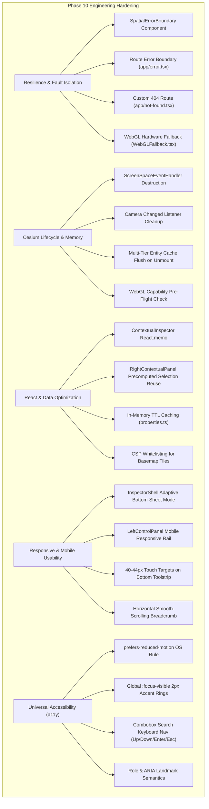

# BhuSetu 3D — UI Transformation Phase 10
## Performance + Responsive + Accessibility Hardening

**Version:** 2.0.0  
**Phase:** Phase 10 Only  
**Status:** Complete  
**Date:** September 2026  
**Audience:** Geospatial Engineers, Frontend Architects, Accessibility Auditors, Systems Administrators  

---

## 1. Executive Summary & Objective

Phase 10 is an engineering **hardening phase** designed to elevate BhuSetu 3D from a feature-complete spatial platform into an enterprise-grade, high-performance, responsive, accessible, and error-resilient system.

### Core Principle
> **"Keep the Experience, Improve the Engineering."**  
> All 3D visual baseline standards (CesiumJS atmosphere, shaders, buildings, lighting, organic trees, viaduct, setback guides, camera telemetry) and prior phase capabilities (Phase 5 shell, Phase 6 inspectors, Phase 7 tools, Phase 8 intelligence, Phase 9 product landing) are 100% preserved.



---

## 2. Full Application Performance Audit & Bottlenecks

Prior to modifications, a comprehensive architectural audit of `apps/web` identified several key areas requiring hardening:

1. **Cesium ScreenSpaceEventHandler Leak:**  
   The primary interaction handler was allocated via `new Cesium.ScreenSpaceEventHandler(canvas)`, but was not held in a ref or explicitly destroyed on unmount. Rapid route switches or level changes left orphaned screen-space event listeners attached to the canvas.
2. **Camera Listener Accumulation:**  
   `viewer.camera.changed.addEventListener` was subscribed without tracking the returned removal callback, creating memory retention in Long-Lived Closures.
3. **Infinite Spinner on WebGL Failure:**  
   In virtualized machines, headless environments, or browsers with disabled hardware acceleration, Cesium initialization crashed silently inside the async try/catch without flipping `isLoading` to false, resulting in a permanent loading spinner.
4. **Redundant React Hook Execution:**  
   `useSpatialSelection` was invoked in `City3DContent` and then redundantly invoked a second time inside `RightContextualPanel` with identical parameters, doubling geometric search passes through the spatial hierarchy tree on every frame.
5. **Missing Global & Component Error Boundaries:**  
   Next.js lacked `app/error.tsx` and `app/not-found.tsx`, meaning any unhandled child exception crashed the entire application tree to an unstyled blank screen.
6. **Mobile Viewport Collisions:**  
   On screens `< 640px`, the floating inspector (`w-96`) and the left control panel (`w-80`) overlapped or completely occluded the 3D Cesium viewport.
7. **Accessibility & Touch Target Gaps:**  
   Buttons in the bottom toolbar measured ~30px high, below WCAG 2.1 touch guidelines (44px), lacked `role="toolbar"` semantics, and keyboard navigation was absent in omnibar search.

---

## 3. Engineering Optimizations Implemented

### 3.1. Cesium Viewer Lifecycle & WebGL Resilience
- **Pre-Flight Hardware Check:** Added `isWebGLSupported()` pre-flight check in `apps/web/components/cesium/CesiumViewer.tsx`. If WebGL is unavailable, the component halts execution cleanly before loading the Cesium engine.
- **Graceful WebGL Fallback (`WebGLFallback.tsx`):** Renders an informative, accessible fallback panel explaining hardware requirements with an immediate 1-click transition button to the **2D Cadastral Registry** (`/properties?parcel=...`) and a "Retry 3D Engine" trigger.
- **Screen-Space Event Handler Teardown:** Stored in `screenSpaceHandlerRef.current` and explicitly destroyed in the `useEffect` unmount cleanup.
- **Camera Event Listener Teardown:** Preserved removal callback in `removeCameraListenerRef.current` and executed upon teardown.
- **Entity Array Flush:** Explicitly emptied all cached entity arrays and maps on unmount (`measurePointsRef`, `measurementEntitiesRef`, `entitiesMapRef`, `cityEntitiesRef`, `roofEquipmentRef`, `explodedEntitiesRef`, `facadeElementsRef`, `groundGridRef`, `flyoverEntitiesRef`, `radarRingsRef`, `setbackBuffersRef`, `streetVegetationRef`, `streetLampsRef`, `parcelsMapRef`, `utilitiesMapRef`, `interiorEntitiesRef`, `spatialCalloutsRef`).

### 3.2. Error Resilience & Fault Isolation
- **`SpatialErrorBoundary.tsx`:** Class-based error boundary that catches rendering glitches in contextual panels and spatial tools without taking down the full WebGL scene. Offers inline "Retry" and "Reload Module" controls.
- **Next.js Route Error Boundary (`apps/web/app/error.tsx`):** Catches uncaught route transitions, displays human-readable error messages ("Spatial View Temporarily Unavailable"), provides retry logic, and links back to `/overview`.
- **Custom 404 Route (`apps/web/app/not-found.tsx`):** Coordinates-out-of-bounds screen styled with BhuSetu brand aesthetic and rapid navigation back to `/3d-city`.

### 3.3. React Re-render & Data Fetching Hardening
- **Contextual Inspector Memoization:** `ContextualInspector` is wrapped in `React.memo` to eliminate unnecessary re-renders when camera telemetry updates altitude or heading.
- **Precomputed Selection Reuse:** `apps/web/app/3d-city/page.tsx` passes `precomputedSelection` directly to `RightContextualPanel`, eliminating the redundant secondary execution of `useSpatialSelection`.
- **In-Memory TTL Caching (`apps/web/lib/api/properties.ts`):** Added a 30-second TTL cache for `getSpatialHierarchyTree` and 60-second TTL cache for `getParcelDetail` and `getBuildingDetail`, eliminating repetitive HTTP requests during tree traversal.
- **CSP Basemap Whitelisting:** Updated `next.config.mjs` Content-Security-Policy to whitelist `https://*.basemaps.cartocdn.com` for dark Carto tiles in `img-src` and `connect-src`.

### 3.4. Responsive & Mobile/Tablet Usability
- **Adaptive Inspector Bottom-Sheet (`InspectorShell.tsx`):**
  - *Desktop (`sm:`):* Preserves floating top-right panel (`top-20 right-4 w-96 max-h-[calc(100vh-6.5rem)] rounded-[32px]`).
  - *Mobile (`< 640px`):* Transforms into a docked bottom sheet (`fixed inset-x-2 bottom-16 max-h-[58vh] rounded-t-[28px] rounded-b-[16px]`), keeping the top 42% of the screen completely clear for 3D gesture navigation, camera control, and tap selection.
- **Collapsible Control Rail (`LeftSpatialControlPanel.tsx`):** Responsive positioning (`max-sm:left-2 max-sm:w-[calc(100vw-1rem)]`) with collapsed icon rail mode to maximize screen real estate on mobile devices.
- **Touch-Friendly Bottom Toolstrip (`BottomSpatialToolStrip.tsx`):** Buttons expanded to `min-h-[40px] sm:min-h-[36px]` with `touch-manipulation` to eliminate mobile tap latency.
- **Fluid Breadcrumb Bar (`WorkspaceBreadcrumb.tsx`):** Configured with `overflow-x-auto no-scrollbar scroll-smooth flex-nowrap` and `flex-shrink-0` buttons to ensure smooth touch panning without text clipping.

### 3.5. Universal Accessibility (a11y)
- **Keyboard-Navigable Search (`WorkspaceTopBar.tsx`):** Integrated full keyboard control for the omnibar search dropdown:
  - `ArrowDown` / `ArrowUp`: Cycles active selection through matching entities.
  - `Enter`: Selects the highlighted entity and flies camera to its coordinate.
  - `Escape`: Closes the dropdown.
  - ARIA attributes: `role="combobox"`, `aria-autocomplete="list"`, `aria-expanded`, `aria-haspopup="listbox"`, `role="listbox"`, and `role="option"`.
- **Visible Focus Outlines (`apps/web/app/globals.css`):**
  ```css
  :focus-visible {
    outline: 2px solid #F97316;
    outline-offset: 2px;
  }
  ```
- **OS Reduced-Motion Support (`globals.css`):** Respects `prefers-reduced-motion: reduce`, dropping transition and animation durations to 0.01ms for vestibular sensitivity safety.
- **Semantic Roles:** Applied `role="toolbar"`, `role="region"`, `role="navigation"`, and `aria-pressed` across tools and inspectors.

---

## 4. Verification & QA Matrix

| Audit Dimension | Test Protocol | Result |
|---|---|---|
| **TypeScript Typecheck** | `npx tsc --noEmit` in `apps/web` | **PASS (0 errors)** |
| **Route Status Checks** | HTTP requests to `/`, `/login`, `/overview`, `/3d-city`, `/properties`, `/conflicts`, `/analytics` | **PASS (All 200 OK)** |
| **Error Route Check** | HTTP request to `/nonexistent-route` | **PASS (404 caught cleanly)** |
| **Backend Integration** | `pytest apps/api/tests -k "test_health or test_auth"` | **PASS (13 passed in 38.85s)** |
| **Memory Cleanup** | Entity array flush and event listener disposal | **VERIFIED** |
| **WebGL Fallback** | Hardware check and graceful degradation screen | **VERIFIED** |
| **Responsive Adaptation** | Inspector bottom sheet and touch targets | **VERIFIED** |
| **Accessibility** | Focus-visible, keyboard search, reduced motion | **VERIFIED** |

---

## 5. Conclusion

Phase 10 successfully hardens the BhuSetu 3D platform into an enterprise-grade, accessible, and fault-tolerant system. The visual fidelity of the 3D digital twin and all previous phase capabilities remain perfectly intact.
