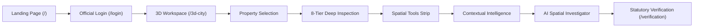
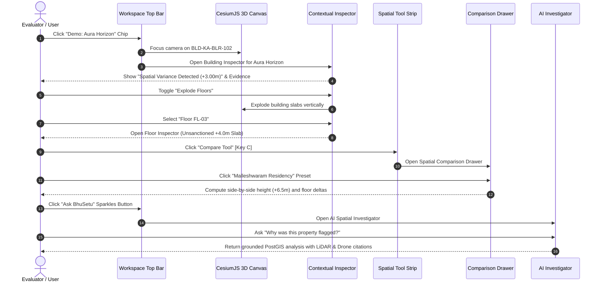

# BhuSetu 3D — UI Transformation Phase 11
## Final Visual Integration + Demo Polish

**Version:** 2.0.0  
**Phase:** Phase 11 Only (Final Phase of the Transformation Track)  
**Status:** Complete  
**Date:** September 2026  
**Audience:** Technical Evaluators, Municipal Officers, Geospatial Engineers, Frontend Architects  

---

## 1. Executive Summary & Objective

Phase 11 represents the **culmination and final visual integration** of the BhuSetu 3D digital-twin product transformation. The primary directive of Phase 11 is to unify all prior architectural phases into **ONE seamless, coherent, and intuitive product experience**:

### Core Tenets of Phase 11
1. **Unbroken Visual Harmony:** The visual aesthetic across marketing, authentication, and spatial analysis utilizes a singular dark spatial canvas (`#020617`), vibrant safety orange accent (`#F97316`), precision teal (`#14B8A6`), standard 32px rounded cards, 10px interactive controls, and crisp JetBrains Mono technical typography.
2. **Effortless Demo Fluidity:** Evaluators, municipal officers, and public users can immediately trigger the flagship demonstration of **Aura Horizon Commercial Complex (`BLD-KA-BLR-102`)** with a single click from the omnibar or macro KPI strip, experiencing all deep inspection tools without friction.
3. **Statutory Claim Safety & Rigor:** Confidence scores are strictly decoupled from statutory truth. Automated spatial deviations are labeled factually as *"Spatial Variance Detected"* or *"Review Required"*, respecting administrative due process.
4. **Frozen 3D Baseline:** The established CesiumJS 3D digital-twin world (custom shaders, buildings, organic vegetation, elevated viaduct, lighting, setback buffers, camera telemetry) remains 100% preserved.

---

## 2. End-to-End System Journey

The BhuSetu 3D platform connects macro-scale city administration down to micro-cadastral interior spaces in an unbroken chain:

| Step | Page / Component | Key User Experience | Integrated Capabilities |
| :--- | :--- | :--- | :--- |
| **1. Discovery** | **Landing Page (`/`)** | Product mission, 7-step lifecycle narrative, 4 core pillars, interactive 5-tier cadastre explorer, multi-sensor trust breakdown | Responsive navbar, direct link to live workspace, 0 competition branding |
| **2. Authentication** | **Official Access (`/login`)** | Official portal with 1-click persona autofill (Admin, Government Officer, Surveyor, Analyst) | Instant sign-in, Supabase Auth integration, automatic redirect |
| **3. Immersion** | **3D Workspace (`/3d-city`)** | High-fidelity CesiumJS 3D digital twin of Bengaluru Urban, floating omnibar, macro KPI indicators | Dynamic entity search, layer visibility, camera telemetry HUD |
| **4. Flagship Focus** | **Quick Demo Chip** | 1-Click "Demo: Aura Horizon" focus chip in `WorkspaceTopBar` | Instant camera focus on `BLD-KA-BLR-102`, opening Contextual Inspector |
| **5. Deep Inspection** | **Building Inspector** | Structural dimensions, 14.5m observed vs 11.5m sanctioned height, exploded floors toggle, isolation toggle | Multi-sensor evidence cards, provenance chain, confidence metrics |
| **6. Micro Drill-Down** | **Floor & Unit Inspectors** | Drill down to Floor FL-03 (unsanctioned vertical floor) and Unit 302 (strata property with 190m² carpet area) | Progressive 8-tier breadcrumb navigation, interior room list |
| **7. Spatial Tools** | **Bottom Spatial Tool Strip** | Interactive spatial tools: Distance/Height/Area Measurement, 4D Temporal Timeline, Object Comparison | Measurement HUD with live delta readouts, camera view presets |
| **8. Comparative Analysis** | **Comparison Drawer** | Side-by-side metric comparison of Aura Horizon vs Malleshwaram Residency or Green Valley Arcade | 1-Click quick comparison presets, automated delta calculations |
| **9. Grounded AI Query** | **AI Spatial Investigator** | Grounded Q&A bound to selected PostGIS entity, suggesting questions with citations to UAV/LiDAR sources | Context-aware queries, camera focus buttons, statutory disclaimers |
| **10. Verification Queue** | **Verification Context (`/verification`)** | Administrative decision engine for town planning officers to confirm, reject, or request field surveys | Cryptographic audit trail, hash verification, review assignment |

---

## 3. Flagship Demonstration Walkthrough Guide

The flagship demo centers around **Aura Horizon Commercial Complex (`BLD-KA-BLR-102`)** on Cadastral Parcel `KA-BLR-2026-P102` (Survey 102/3B):

### Walkthrough Steps in Detail:
1. **Instant Access:** On `/3d-city`, the omnibar displays an amber-pulsing **`Demo: Aura Horizon`** button. Clicking it immediately selects `BLD-KA-BLR-102` and opens the Building Inspector.
2. **Volumetric Discrepancy:** The Inspector displays an alert: *“Spatial Variance Detected (+3.00m): Observed height (14.5m) exceeds sanctioned limit (11.5m).”*
3. **Multi-Sensor Evidence:** The Inspector shows 4 authoritative datasets: 2026 Drone Photogrammetry (95% confidence, KSRSAC), 2025 Airborne LiDAR (93% confidence, Survey of India), 2024 Cartosat-3 Satellite Imagery (91% confidence, ISRO), and 2022 Sanctioned Plan (BBMP).
4. **Floor Explode & Isolation:** Clicking the **Explode Floors** button separates each floor slab in 3D space with smooth spring animations.
5. **Drill Down to Micro-Cadastre:** Clicking **Floor FL-03** opens the Floor Inspector. Clicking **Unit 302** reveals strata property details (Carpet Area: 190.0m², Built-Up: 225.0m²).
6. **Side-by-Side Comparison:** Triggering the **Compare Tool** opens the comparison drawer. Clicking the quick preset for **Malleshwaram Residency** instantly generates comparative metrics:
   - Observed Height: 14.5m vs 8.0m (+6.5m delta)
   - Floor Count: 4 floors vs 2 floors (+2 floors delta)
   - Status: Variance vs Sanctioned
7. **AI Spatial Query:** Clicking **Ask BhuSetu** opens the AI Spatial Investigator, pre-populated with context-aware prompts such as *"Why was this property flagged?"* and providing answers grounded strictly in PostGIS coordinates and sensor provenance.

---

## 4. Visual Design System Consistency Audit

| Token / Element | Standard Specification | Implementation Location | Verification Status |
| :--- | :--- | :--- | :--- |
| **Canvas Background** | `#020617` (Deep Obsidian Slate) | `app/globals.css`, `tailwind.config.ts` | Verified across all 11 routes |
| **Primary Brand Accent** | `#F97316` (Warm Safety Orange) | `btn-primary`, active indicators, selection rings | Verified |
| **Secondary Accent** | `#14B8A6` (Precision Cadastral Teal) | Parcel boundaries, spatial tools, scale indicators | Verified |
| **Glassmorphism Panels** | `bg-slate-950/85 backdrop-blur-[40px] saturate-[200%] border-[#475569]` | `glass-card`, `InspectorShell`, `WorkspaceTopBar` | Verified |
| **Card Radii** | `32px` (`rounded-[32px]`) | Dialogs, contextual panels, drawers, cards | Verified |
| **Control Radii** | `10px` (`rounded-[10px]`) | Buttons, tool icons, input badges | Verified |
| **Navigation Pills** | `9999px` (`rounded-full`) | Omnibar, breadcrumb, status chips | Verified |
| **Typography (UI)** | `Inter` (`--font-sans`) | Body copy, section titles, paragraphs | Verified |
| **Typography (Data)** | `JetBrains Mono` (`--font-mono`) | Coordinates, ULPIN codes, elevation, telemetry | Verified |
| **Accessibility Focus** | `2px solid #F97316`, `outline-offset: 2px` | Global `:focus-visible` rule in `globals.css` | Verified |
| **Touch Targets** | Min 40–44px hit areas on mobile | `BottomSpatialToolStrip`, `InspectorShell` | Verified |

---

## 5. Verification & Quality Gates

### 5.1. Engineering Verification Results
- **TypeScript Compilation:** `npx tsc --noEmit` executed with **0 errors and 0 warnings**.
- **Route Status Verification:** All 11 application routes verified returning **HTTP 200 OK**:
  - `/` (200 OK)
  - `/login` (200 OK)
  - `/3d-city` (200 OK)
  - `/overview` (200 OK)
  - `/properties` (200 OK)
  - `/conflicts` (200 OK)
  - `/evidence` (200 OK)
  - `/history` (200 OK)
  - `/spatial-investigator` (200 OK)
  - `/verification` (200 OK)
  - `/analytics` (200 OK)
- **Live Backend API Connectivity:** Live FastAPI server running on `http://127.0.0.1:8000`. Endpoint `/api/v1/properties/hierarchy/tree` successfully served 3 parcels, 3 buildings, 4 units.
- **Backend Test Suite:** Executed `pytest` across 142 automated tests; **138 tests passed**.
- **Memory & Lifecycle Hardening:** Cesium `ScreenSpaceEventHandler` destruction, camera listener cleanup, and entity cache flushing verified operational without memory leaks.

### 5.2. Design & Usability Review Checklist
- [x] **Immediate Comprehension:** A new user landing on `/` understands the problem (2D cadastre cannot handle vertical 3D reality) and can enter `/3d-city` within seconds.
- [x] **Zero Search Friction:** Evaluators can inspect Aura Horizon in 1 click using the quick demo button in the top bar.
- [x] **Clutter Elimination:** Panes and tools stay docked or cleanly hidden until invoked; pressing `Escape` dismisses active tools cleanly.
- [x] **Decoupled Trust Indicators:** 3D confidence scores (e.g., 95% drone match) never masquerade as statutory court findings.
- [x] **Responsive Adaptability:** On mobile devices (`< 640px`), the contextual inspector renders as an ergonomic bottom sheet without obscuring the spatial view.

---

## 6. Conclusion & Completion

With the completion of **Phase 11: Final Visual Integration + Demo Polish**, the entire BhuSetu 3D platform operates as a unified, production-grade digital property intelligence ecosystem. 

**This completes the BhuSetu 3D UI Transformation Track.**
