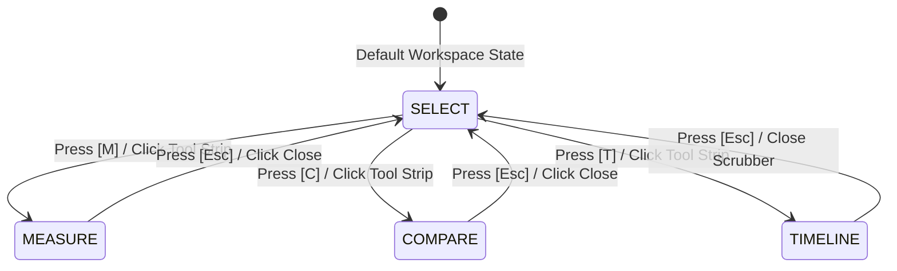

# BHUSETU 3D — PHASE 7: SPATIAL TOOLS & NAVIGATION ARCHITECTURE SPECIFICATION
## Phase 7: Real-Time 3D Geospatial Measurement, Spatial Comparison & Camera Navigation Engine

---

## 1. Executive Summary & North Star

Phase 7 transforms the **BhuSetu 3D Digital Twin** into an active spatial property intelligence workspace. Prior to Phase 7, users could inspect entities hierarchically across 8 levels (`CITY` → `REGION` → `PARCEL` → `BUILDING` → `FLOOR` → `UNIT` → `ROOM` → `ELEMENT`). In Phase 7, users are equipped with first-class spatial analytical capabilities:
1. **Multi-Mode 3D Measurement Engine**: Real-time Euclidean 3D distance, horizontal ground projection distance, vertical height delta ($\Delta h$), and Shoelace planar polygon area & perimeter calculation directly on CesiumJS geometry.
2. **Spatial Object Comparison Engine**: Dual-highlight comparison between Object A and Object B, automated variance calculus ($\Delta \text{Height}$, $\Delta \text{Floors}$, $\Delta \text{Area}$, compliance status, base elevation), and side-by-side comparative inspection.
3. **Spatial Navigation & Telemetry**: Dynamic metric scale bar responsive to camera altitude, true North rotating needle compass, camera view presets (`2D Nadir`, `3D Perspective`, `True North`, `Frame Selected [F]`, `Reset Home`), and 2D Cadastral map integration.
4. **Structured Spatial Control Panel**: Reorganized layers rail categorized into `PROPERTY`, `INFRASTRUCTURE`, and `CONTEXT & INTELLIGENCE` with active layer counters and live PostGIS integration.

---

## 2. Spatial Tools Architecture

### 2.1 State Management

- **Active Spatial Tool**: Controlled by `activeSpatialTool` (`"SELECT" | "MEASURE" | "COMPARE" | "TIMELINE"`).
- **Measurement Mode**: Controlled by `measurementMode` (`"DISTANCE" | "HEIGHT" | "AREA"`).
- **Comparison State**: Managed by `ComparisonState` with states:
  - `SELECTING_A`: Object A awaiting selection
  - `SELECTING_B`: Object A selected, awaiting Object B pick in 3D or Outliner
  - `COMPARING`: Both objects selected, comparative variances computed and synchronized

---

## 3. Mathematical Foundations & Coordinate Geometry

### 3.1 3D Euclidean & Horizontal Distance
Given two 3D Cartesian coordinates $P_1 = (x_1, y_1, z_1)$ and $P_2 = (x_2, y_2, z_2)$:
$$d_{3D} = \sqrt{(x_2 - x_1)^2 + (y_2 - y_1)^2 + (z_2 - z_1)^2}$$

Converting $P_1, P_2$ to Cartographic coordinates $(lng_1, lat_1, h_1)$ and $(lng_2, lat_2, h_2)$:
- **Height Delta**:
$$\Delta h = |h_2 - h_1|$$
- **Horizontal Ground Distance** ($R = 6,378,137\text{ m}$):
$$\bar{\phi} = \frac{lat_1 + lat_2}{2}$$
$$dx = (lng_2 - lng_1) \cdot R \cdot \cos(\bar{\phi})$$
$$dy = (lat_2 - lat_1) \cdot R$$
$$d_{horiz} = \sqrt{dx^2 + dy^2}$$

### 3.2 Planar Polygon Area (Shoelace Formula on Local ENU Projection)
Given $N$ polygon vertices $P_0, P_1, \dots, P_{N-1}$ on the Cesium 3D surface:
1. Compute the centroid Cartographic coordinate $(\bar{\lambda}, \bar{\phi})$.
2. Project each vertex to tangent East-North coordinates $(x_i, y_i)$ in meters:
$$x_i = (\lambda_i - \bar{\lambda}) \cdot R \cdot \cos(\bar{\phi})$$
$$y_i = (\phi_i - \bar{\phi}) \cdot R$$
3. Compute Shoelace Area ($m^2$):
$$A = \frac{1}{2} \left| \sum_{i=0}^{N-1} (x_i y_{i+1} - x_{i+1} y_i) \right| \quad (\text{with } x_N = x_0, y_N = y_0)$$
4. Compute Perimeter ($m$):
$$P = \sum_{i=0}^{N-1} \sqrt{(x_{i+1} - x_i)^2 + (y_{i+1} - y_i)^2}$$

---

## 4. Component Manifest

| Component | Path | Description |
| :--- | :--- | :--- |
| `MeasurementHUD` | `apps/web/components/workspace/tools/MeasurementHUD.tsx` | Floating translucent HUD bar with mode switches (`Distance`, `Height Δ`, `Area`), dynamic instructions, clear, and live metric result card. |
| `SpatialCompass` | `apps/web/components/workspace/tools/SpatialCompass.tsx` | Interactive rotating needle compass linked to camera heading. Clicking smoothly rotates camera to True North ($0^\circ$). |
| `SpatialScaleBar` | `apps/web/components/workspace/tools/SpatialScaleBar.tsx` | Dynamic metric scale bar ($5\text{m}$ to $10\text{km}$) scaling proportionally with camera altitude. |
| `SpatialComparisonDrawer` | `apps/web/components/workspace/tools/SpatialComparisonDrawer.tsx` | Slide-in drawer comparing Object A and Object B properties, typologies, heights, floors, and automated variance metrics. |
| `BottomSpatialToolStrip` | `apps/web/components/workspace/BottomSpatialToolStrip.tsx` | Bottom dock with Inspect (`[V]`), Measure (`[M]`), Compare (`[C]`), 4D Timeline (`[T]`), Camera Presets menu, and 2D Cadastre navigation. |
| `LeftSpatialControlPanel` | `apps/web/components/workspace/LeftSpatialControlPanel.tsx` | Collapsible left rail with categorized layers (`PROPERTY`, `INFRASTRUCTURE`, `CONTEXT & INTELLIGENCE`), Outliner, and Tools. |
| `CesiumViewer` | `apps/web/components/cesium/CesiumViewer.tsx` | WebGL 3D digital twin viewport with enhanced multi-mode measurement entity rendering, Object B comparison highlight, camera presets, and live telemetry. |

---

## 5. Keyboard Navigation Matrix

| Hotkey | Action | Description |
| :---: | :--- | :--- |
| `[V]` / `[I]` | **Inspect Mode** | Activate standard 3D entity selection and inspector. |
| `[M]` | **Toggle Measure** | Toggle 3D measurement tool and open `MeasurementHUD`. |
| `[C]` | **Toggle Compare** | Toggle 3D spatial comparison mode and open `SpatialComparisonDrawer`. |
| `[T]` | **Toggle Timeline** | Open 4D multi-epoch temporal footprint change scrubber. |
| `[L]` | **Toggle Layers** | Expand or collapse left spatial control panel. |
| `[F]` | **Frame Selected** | Fly camera to selected building/parcel bounding sphere. |
| `[N]` | **Orient North** | Reorient camera heading to True North ($0^\circ$). |
| `[2]` | **2D Cadastre** | Navigate to `/properties?parcel=...` 2D cadastral interface. |
| `[Home]` | **Reset Camera** | Reset camera to default 3/4 perspective hero view. |
| `[Esc]` | **Contextual Cancel** | Exit compare / clear measurement / close modal / step up hierarchy. |

---

## 6. Verification & Quality Assurance

- **TypeScript Compilation**: `npx tsc --noEmit` passed with 0 errors.
- **Backend API Health**: `GET /api/v1/health` verified `HTTP 200 OK`.
- **Frontend Routes**: `GET /3d-city` and `GET /properties` verified `HTTP 200 OK`.
- **Visual Baseline Integrity**: 100% of existing Cesium visual foundation (terrain, building procedural textures, atmospheric lighting, elevated viaduct, organic shade trees, setback guides) preserved intact.
