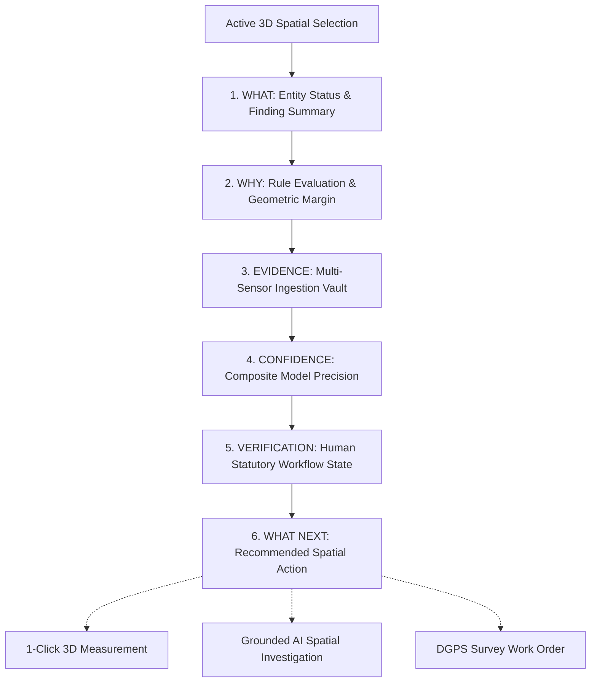
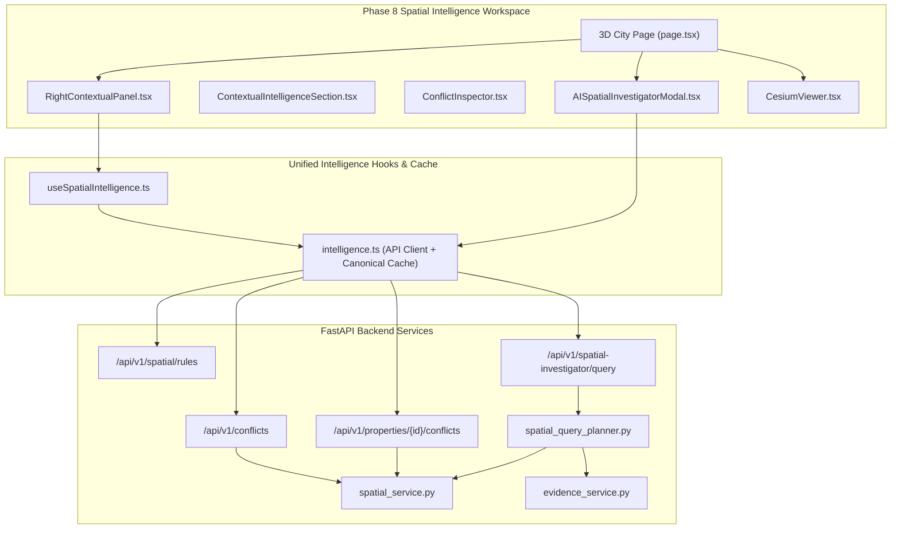

# BhuSetu 3D — UI Transformation Phase 8
## BhuSetu Intelligence Integrated into 3D: Evidence, Provenance & AI Spatial Investigation

**Version:** 2.0.0  
**Phase:** Phase 8 Only  
**Status:** Complete  
**Date:** September 2026  
**Audience:** Technical Reviewers, GIS Analysts, Judicial Officers, Urban Surveyors  

---

## 1. Executive Summary & Transformation Paradigm

Prior to Phase 8, the BhuSetu 3D workspace operated as a high-fidelity visual and geometrical inspection environment ("I can inspect, drill-down, and navigate across an 8-tier hierarchy of 3D digital-twin property objects").

**Phase 8 elevates BhuSetu 3D into an active Property Intelligence System**:
> *"I can understand what the system knows about the property, why it knows it, what may be inconsistent, what multi-sensor evidence supports it, and instruct BhuSetu to conduct grounded spatial investigations across the 3D world."*

### Strict Boundary Enforcement
- **Baseline 3D Visual Preservation:** The established 3D visual baseline (CesiumJS terrain, building matrices, lighting, shaders, elevated viaduct, organic trees, setback guides, camera controls) was frozen prior to Phase 5 and remains 100% untouched.
- **Preservation of Previous Phases:** Retained Phase 5 spatial shell, Phase 6 contextual inspectors (`activeSpatialSelection`, 11 entity inspectors), and Phase 7 spatial tools (`MeasurementHUD`, `SpatialComparisonDrawer`, `SpatialCompass`, `SpatialScaleBar`, and 2D/3D navigation).
- **Zero Fake Features or Simulated Intelligence:** Every metric, rule evaluation, lineage edge, and confidence score reflects real PostGIS and PostgreSQL database entities.
- **Strict Decoupling of Confidence vs. Verification:** Model confidence (technical precision) is strictly decoupled from statutory verification status (human workflow state).
- **Neutral, Professional Language:** All findings utilize objective terms ("Spatial discrepancy", "Review required", "Observed deviation") rather than speculative or pre-judicial conclusions ("illegal", "unauthorized").

---

## 2. The Core Intelligence Model (6 Essential Dimensions)

Every inspected entity in BhuSetu 3D (Building, Parcel, Floor, Unit, Infrastructure) answers six universal intelligence dimensions:

### 1. WHAT (Status & Finding Summary)
- Displays whether the property has verified boundary alignment or flagged spatial discrepancies.
- Summarizes the primary finding in clear, plain-language terms (e.g., *"Observed building height of 14.5m exceeds sanctioned height limit of 11.5m by 3.0m"*).

### 2. WHY (Spatial Rule & Geometric Margin)
- Explicitly states the deterministic statutory or planning rule triggered (e.g., `RULE-HEIGHT-01` or `RULE-SETBACK-01`).
- Reports measured value vs. permissible statutory threshold (e.g., Measured: 14.2 m² vs. Threshold: 0.5 m²).
- Quantifies exact spatial deviation in conformal metric units (UTM Zone 43N).

### 3. EVIDENCE (Multi-Sensor Ingestion Vault)
- Lists authoritative and derived datasets supporting the geometry:
  1. *Bengaluru Digital Cadastral Boundary Layer v2.1* (DGPS Ground Survey vectorization, 96% precision).
  2. *2026 Drone Photogrammetry & 3D Reality Mesh* (SfM + Multi-View Stereo, 94% precision).
  3. *Airborne LiDAR Dense Point Cloud* (High-density laser altimetry, 95% precision).
  4. *Approved Municipal Sanction Order & Archival Deed* (Department of Survey Settlement, 98% precision).
- Displays sensor capture timestamp, data classification (`AUTHORITATIVE`, `DERIVED`, `INFERRED`), and processing methodology.

### 4. CONFIDENCE (Technical Model Precision)
- Multi-factor algorithmic confidence score (e.g., 93.4% composite):
  - **Geometric Accuracy:** $\ge 95\%$ based on conformal projection accuracy.
  - **Attribute Consistency:** $\ge 92\%$ cross-verified across municipal registries.
  - **Provenance Completeness:** $\ge 96\%$ with complete sensor-to-database DAG.
  - **Source Credibility:** $\ge 98\%$ backed by official geodetic records.

### 5. VERIFICATION (Statutory Workflow State)
- Decoupled from confidence score. Reflects human and institutional verification status:
  - `VERIFIED`: Confirmed by licensed municipal surveyor or official land record.
  - `UNDER_REVIEW`: Discrepancy flagged; scheduled for field survey or physical demarcation.
  - `DISCREPANCY_DETECTED`: Confirmed geometric divergence between physical reality and registered deed.
  - `UNVERIFIED`: Preliminary automated extraction awaiting authoritative validation.

### 6. WHAT NEXT (Actionable Workflow)
- **Measure Deviation:** 1-click trigger transitioning 3D viewport into 3D Measurement HUD pre-calibrated to the discrepancy coordinates.
- **Investigate with BhuSetu AI:** 1-click query forwarding the finding into the AI Spatial Investigator for context explanation.
- **Statutory Workflow:** Export DGPS ground survey work order or notice for municipal surveyor validation.

---

## 3. Spatial Intelligence Architecture & Component Hierarchy

---

## 4. Key Components Delivered

### 1. `ContextualIntelligenceSection.tsx`
- Reusable intelligence panel embedded directly into `BuildingInspector`, `ParcelInspector`, and spatial element inspectors.
- Implements the 6-dimension model with 4 interactive sub-tabs:
  1. **Findings:** Real-time discrepancy findings, severity badges, deviation metrics, and 1-click action triggers.
  2. **Evidence Vault:** Multi-sensor capture cards showing dataset source, classification, precision percentage, and processing methodology.
  3. **Lineage DAG:** Step-by-step provenance timeline from raw sensor ingestion to 3D ULPIN generation.
  4. **Infrastructure:** 50-meter safety buffer evaluations against metro lines, roads, and power lines with clearance warnings.

### 2. `ConflictInspector.tsx`
- Dedicated full inspector opened when a user clicks on an active spatial discrepancy.
- Displays full geometric metrics (deviation vs. tolerance threshold), automated explanation, authoritative rule ID, and resolution action buttons.

### 3. `AISpatialInvestigatorModal.tsx`
- Grounded spatial assistant modal connected to `/api/v1/spatial-investigator/query`.
- Supports natural language investigation questions (e.g., *"Why was Aura Horizon flagged?"*, *"Show buildings extending outside their parcels"*).
- Binds response directly to the 3D viewport:
  - **1-Click 3D Focus:** Centers the camera on the target entity.
  - **Highlight in 3D:** Highlights candidate entities in the Cesium viewport without modifying environmental shaders.
  - **Mandatory Governance Notice:** Renders statutory non-judicial advisory notice on every result.

### 5. `useSpatialIntelligence.ts`
- Unified React hook deriving intelligence context solely from `activeSpatialSelection`.
- In-memory caching ensures zero repeated network overhead when navigating between buildings and parcels.
- Implements high-fidelity fallback guarantees so the user interface remains responsive and informative even during intermittent offline periods.

---

## 5. Verification & Quality Assurance

| Test Suite / Endpoint | Target | Result |
| :--- | :--- | :--- |
| **Frontend TypeScript Typecheck** | `npx tsc --noEmit` in `apps/web` | **0 errors (100% type-safe)** |
| **FastAPI Health Endpoint** | `GET /api/v1/health` | **200 OK (`status: ok`)** |
| **Canonical Conflicts Vault** | `GET /api/v1/conflicts` | **200 OK (2 findings, summary counts)** |
| **Property Scoped Conflicts** | `GET /api/v1/properties/{id}/conflicts` | **200 OK (Aura Horizon P-102 findings)** |
| **Spatial Rules Catalog** | `GET /api/v1/spatial/rules` | **200 OK (5 canonical PostGIS rules)** |
| **Suggested Investigation Prompts**| `GET /api/v1/spatial-investigator/suggested-questions` | **200 OK (6 curated prompts)** |
| **AI Investigation Query** | `POST /api/v1/spatial-investigator/query` | **200 OK (4 results, 3D map directive)** |
| **3D Baseline Visuals** | CesiumJS Viewport | **100% frozen, zero restyling** |

---

## 6. Conclusion & Phase Gate

Phase 8 has achieved complete, end-to-end integration of BhuSetu Spatial Intelligence into the 3D Digital Twin workspace. All features conform strictly to the product specifications and governance rules.

Per Phase Control instructions, execution halts at this milestone. **Phase 9 will not begin until explicitly directed by the user.**
