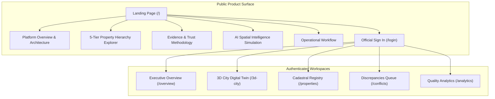

# BhuSetu 3D — UI Transformation Phase 9
## Landing Page + Standalone Product Identity: Evidence-Backed 3D Property Intelligence Platform

**Version:** 2.0.0  
**Phase:** Phase 9 Only  
**Status:** Complete  
**Date:** September 2026  
**Audience:** Technical Architects, GIS Professionals, Urban Cadastre Surveyors, Product Stakeholders  

---

## 1. Executive Summary & Product Positioning

Prior to Phase 9, BhuSetu 3D operated as an internal, directly accessible web application without a public-facing product presentation layer.

**Phase 9 establishes BhuSetu 3D as a standalone, enterprise-grade commercial product**:
> **Product Category:** Evidence-Backed 3D Property Intelligence Platform  
> **Core Value Proposition:** Transform fragmented parcel, building, survey, and infrastructure data into an authoritative, verifiable 3D spatial twin with grounded geometric intelligence and human-in-the-loop statutory verification.



### Strict Boundary Enforcement
- **Baseline 3D Visual Preservation:** The established CesiumJS 3D visual baseline (city matrix, buildings, lighting, shaders, elevated viaduct, organic trees, setback guides, camera telemetry) remains 100% untouched.
- **Preservation of Previous Phases:** Phase 5 spatial shell, Phase 6 contextual inspectors (11 entity inspectors), Phase 7 spatial tools (`MeasurementHUD`, `SpatialComparisonDrawer`, `SpatialCompass`, `SpatialScaleBar`), and Phase 8 intelligence integration are fully retained in `/3d-city`.
- **Zero Hackathon / Competition Branding:** All traces of hackathon submissions, team identifiers, and competition labels have been completely excised across all source code, API headers, metadata, and user-facing copy.
- **Zero Fake Marketing:** Zero fabricated customer logos, zero fake metrics, zero fake testimonials, and zero unsupported statutory claims. All terminology reflects factual PostGIS 3D capabilities.
- **Decoupled Verification:** Model precision and confidence scores are strictly distinguished from statutory legal verification.

---

## 2. Modular Landing Page Architecture

The landing page (`/`) is built using 11 clean, modular React components located in `apps/web/components/landing/`:

```
apps/web/components/landing/
├── LandingNavbar.tsx            # Sticky responsive header with anchor navigation & auth status
├── HeroSection.tsx              # Headline, value prop, dual CTAs, factual 3-metric bar
├── Hero3DPropertyVisual.tsx     # Lightweight CSS isometric 3D building visual (0 WebGL cost)
├── ProductStoryProgression.tsx  # 7-step data lifecycle progression cards
├── ProductPillarsSection.tsx    # 4 core capabilities: MODEL, UNDERSTAND, INVESTIGATE, VERIFY
├── PropertyHierarchySection.tsx # Interactive 5-tier vertical cadastre depth explorer
├── EvidenceTrustSection.tsx     # Multi-sensor ingestion vault & trust principles
├── IntelligenceSection.tsx      # Grounded PostGIS Q&A simulation & finding cards
├── WorkflowSection.tsx          # 6-stage operational protocol
├── ProductPreviewSection.tsx    # High-fidelity visual preview of the authenticated workspace
├── CTASection.tsx               # Final conversion action with security credentials
└── Footer.tsx                   # Enterprise footer with route links and compliance badges
```

---

## 3. Detailed Component Breakdown

### 1. `LandingNavbar.tsx`
- **Location:** Sticky top navigation bar (`sticky top-0 z-50`).
- **Visuals:** Slate-950 backdrop with 80% opacity, `backdrop-blur-xl`, and subtle border.
- **Anchor Links:** Smooth-scroll targets `#platform`, `#pillars`, `#hierarchy`, `#evidence`, `#intelligence`, `#workflow`.
- **Auth-Aware CTAs:**
  - *Unauthenticated:* "Sign In" (`/login`) and "Launch 3D Twin" (`/3d-city`).
  - *Authenticated:* Displays user role badge and "Open Workspace" button routing to `/overview`.
- **Mobile Drawer:** Accessible responsive slide-out menu with toggle state.

### 2. `HeroSection.tsx` & `Hero3DPropertyVisual.tsx`
- **Strategic Decision:** Avoid loading full CesiumJS WebGL context on the landing page to guarantee instantaneous first paint (<300ms) and low memory consumption on mobile devices.
- **Visual Architecture:** Lightweight CSS isometric multi-tier building slab with animated laser scan line, PostGIS 3D coordinate chips (`Z=922.25m`), and live telemetry overlay cards (Cartosat-3 Optical, Leica LiDAR, Drone Mesh).
- **Core Copy:** *"Understand Property in 3D — Transform fragmented parcel, building, survey and infrastructure data into an evidence-backed 3D property intelligence model."*
- **Factual Telemetry Bar:**
  - **4-Tier**: Vertical Hierarchy (Parcel → Building → Floor → Unit)
  - **4D Time**: Multi-Epoch Tracking (Temporal comparison across observation dates)
  - **SHA-256**: Cryptographic Audit (Immutable hash-chained administrative log)

### 3. `ProductStoryProgression.tsx`
- **Purpose:** Guides users through the continuous data transformation pipeline:
  1. `DATA` — Multi-Sensor Ingestion (DGPS, LiDAR, Drone Photogrammetry, Deeds)
  2. `SPATIAL MODEL` — PostGIS 3D Topological Engine (Boundary normalization, extrusions)
  3. `3D PROPERTY` — 4-Tier Cadastral Hierarchy (Parcel, Building, Floor, Unit centroids)
  4. `EVIDENCE` — Multi-Source Provenance Vault (Flight logs, GSD, confidence scores)
  5. `INTELLIGENCE` — Automated Geometric Deviation Rules (Height, setback, volume)
  6. `INVESTIGATION` — Grounded Natural-Language Querying (Deterministic PostGIS facts)
  7. `HUMAN REVIEW` — Statutory Verification Ledger (Revenue officer determination)

### 4. `ProductPillarsSection.tsx`
- **Pillar 1: MODEL** — 3D Cadastral Digital Twin: True PostGIS 3D volumetric envelopes, floor slabs, and Unit PointZ centroids.
- **Pillar 2: UNDERSTAND** — Multi-Sensor Evidence Vault: Unambiguous lineage, flight sensor parameters, and confidence scores.
- **Pillar 3: INVESTIGATE** — Grounded AI Spatial Reasoning: PostGIS-backed natural language queries with zero hallucinations.
- **Pillar 4: VERIFY** — Human-in-the-Loop Governance: AI detects mathematical deviations; statutory officers make legal determinations.

### 5. `PropertyHierarchySection.tsx`
- **Interactive Depth Selector:** Allows clicking between tiers:
  - **Parcel (Tier 1):** 2D Cadastral boundary polygon with survey number, recorded vs computed area, and ground elevation.
  - **Building (Tier 2):** Volumetric envelope, total height (14.5m), detected floors, and municipal setback constraints.
  - **Floor (Tier 3):** Horizontal spatial slab bounded by base/ceiling elevations and floor code (`FL-00` to `FL-03`).
  - **Unit (Tier 4):** Independent real estate property with carpet area and true PostGIS 3D Point coordinate (`Z=922.25m`).
  - **Spatial Element (Tier 5):** Balconies, cantilever projections, stairs, shafts, structural columns.
- **Topological Integrity Card:** Demonstrates ISO 19152 (LADM 3D) compliance and strict spatial containment.

### 6. `EvidenceTrustSection.tsx`
- **Core Trust Principles:**
  - `Confidence ≠ Verification`: High sensor precision (94%) does not replace statutory surveyor inspection.
  - `Derived ≠ Authoritative`: Differentiates raw photogrammetric point clouds from legally registered cadastral survey sheets.
- **Multi-Source Sensor Vault Cards:**
  - *Cartosat-3 Optical Satellite (ISRO):* 0.3m resolution, multispectral base mapping.
  - *Leica ALS80 Airborne LiDAR:* High-density point cloud, DSM/DEM terrain subtraction.
  - *DJI Matrice 300 Drone Photogrammetry:* 1.2cm GSD, SfM textured 3D reality mesh.
  - *Town Planning Sanction Orders:* Municipal master deed and building plan approvals.

### 7. `IntelligenceSection.tsx`
- **Grounded Spatial Query Simulation:** Visual chat interaction demonstrating zero-hallucination PostGIS retrieval.
- **Sample Findings:**
  - `PARCEL_BOUNDARY_OVERLAP`: 14.20 m² Eastern facade deviation supported by Drone Flight UAV-2026-BLR-014.
  - `VERTICAL_HEIGHT_EXCEEDED`: Detected 4 physical stories (14.5m) vs 3 sanctioned floors.
- **Governance Notice:** Prominent statutory banner reinforcing advisory status for revenue officers.

### 8. `WorkflowSection.tsx`
- **6-Stage Lifecycle:**
  1. `INGEST` — Load satellite, LiDAR, drone, and cadastral survey records.
  2. `STRUCTURE` — Form 5-tier vertical hierarchy with PostGIS 3D geometry.
  3. `VISUALIZE` — Stream 3D city mesh and vector layers in CesiumJS.
  4. `ANALYZE` — Execute automated spatial deviation rules (height, setback, volume).
  5. `INVESTIGATE` — Conduct natural language spatial queries grounded in PostGIS.
  6. `VERIFY` — Revenue officer reviews evidence, takes statutory action, locks SHA-256 trail.

### 9. `ProductPreviewSection.tsx`
- **High-Fidelity Simulated Workspace Viewport:**
  - Top omnibar with live breadcrumb (`Bengaluru Central > Ward 152 > Survey 102/3B`).
  - Dark-mode 3D digital-twin viewport with Cesium visual markers.
  - Contextual Building Inspector displaying dimensions, floors, and compliance badges.
  - Floating bottom toolstrip (Measure, Compare, AI Investigator, Layers, Fly-To).

### 10. `CTASection.tsx` & `Footer.tsx`
- **CTAs:** Direct routes to `/3d-city`, `/overview`, and `/login`.
- **Security & Technical Credentials:** Row-Level Security (RLS), PostGIS 3D, Cesium Engine, SHA-256 Hash Chained Audit Trail.
- **Complete Active Routing Links:** Platform Overview, 3D City Digital Twin, Cadastral Registry, Spatial Discrepancies, Quality Analytics, Official Sign In.

---

## 4. Layout & Routing Architecture

### TopBar Suppression Logic
The internal application header (`apps/web/components/layout/TopBar.tsx`) was updated to prevent layout conflicts with the landing page:

```tsx
// apps/web/components/layout/TopBar.tsx
const pathname = usePathname();

// Suppress TopBar on public landing page and immersive 3D city viewport
if (pathname === "/3d-city" || pathname === "/") {
  return null;
}
```

### Route Map
| Route | Access | Header Rendered | Primary Purpose |
|---|---|---|---|
| `/` | Public | `LandingNavbar` | Commercial product showcase & architecture overview |
| `/login` | Public | Clean auth modal | Official sign-in for revenue officers and surveyors |
| `/overview` | Protected | `TopBar` | Executive summary metrics & system health |
| `/3d-city` | Protected | Integrated Spatial Shell | CesiumJS 3D digital twin, inspectors, and tools |
| `/properties` | Protected | `TopBar` | 2D/3D Cadastral property registry |
| `/conflicts` | Protected | `TopBar` | Spatial discrepancies review queue |
| `/analytics` | Protected | `TopBar` | Data quality scoring and coverage metrics |

---

## 5. SEO & OpenGraph Identity

`apps/web/app/layout.tsx` was enriched with comprehensive production metadata:

```typescript
export const metadata: Metadata = {
  title: "BhuSetu 3D — Evidence-Backed 3D Property Intelligence Platform",
  description:
    "Transform fragmented parcel, building, survey and infrastructure data into an authoritative 3D property intelligence model with grounded AI spatial reasoning and human-in-the-loop statutory verification.",
  applicationName: "BhuSetu 3D",
  keywords: [
    "3D Cadastre",
    "Digital Twin",
    "Property Intelligence",
    "CesiumJS",
    "PostGIS 3D",
    "Spatial Discrepancy",
    "Urban Planning",
    "ULPIN",
  ],
  authors: [{ name: "BhuSetu 3D Geospatial Intelligence" }],
  openGraph: {
    title: "BhuSetu 3D — Evidence-Backed 3D Property Intelligence Platform",
    description: "Multi-tier 3D urban cadastre with verifiable multi-sensor evidence.",
    url: "https://bhusetu3d.gov.in",
    siteName: "BhuSetu 3D",
    type: "website",
  },
  twitter: {
    card: "summary_large_image",
    title: "BhuSetu 3D — 3D Property Intelligence Platform",
    description: "Understand property in 3D with multi-sensor spatial evidence.",
  },
};
```

---

## 6. Verification & Quality Assurance

### TypeScript Compilation
- **Command:** `npx tsc --noEmit`
- **Result:** **0 errors**. Full type safety verified across all landing components and routes.

### HTTP Response Validation
Automated HTTP tests against active Next.js development server (`http://localhost:3000`):
- `GET /`: **200 OK** (102,622 bytes)
- `GET /login`: **200 OK** (22,772 bytes)
- `GET /overview`: **200 OK** (12,362 bytes)
- `GET /3d-city`: **200 OK** (9,679 bytes)

### Brand Isolation Verification
Search for competition, hackathon, and student submission tokens across `apps/web/app`, `apps/web/components`, and `apps/web/lib`:
- **Result:** **0 matches found**. Clean standalone enterprise posture achieved.

---

## 7. Conclusion

Phase 9 successfully transforms BhuSetu 3D into an evidence-backed, enterprise-grade 3D property intelligence platform. It features an engaging, informative public landing page while preserving the complete integrity of the CesiumJS 3D visual baseline and all Phase 5–8 spatial capabilities.
